# UnrealSkillProject : Spy Project

*UE 5.7 · Dedicated Server · 커스텀 GAS · 모듈형 아키텍처 — 확장 가능한 멀티플레이어 액션 프레임워크.*

[]()
[]()
[]()
[]()
[]()

이 프로젝트는 언리얼 엔진 5.7 기반 스파이 테마 3인칭 액션 게임입니다.
완벽한 멀티플레이 동기화를 목표로 데디케이티드 서버(Dedicated Server) 환경에서 동작하며,
Lyra 스타일의 모듈형 아키텍처, 자체 래핑한 SKGAS 프레임워크,
그리고 모든 기획 데이터를 DataAsset으로 분리한 데이터 지향 설계(Data-Oriented Design)를 통해
확장성과 유지보수성을 극대화했습니다.

파쿠르 · 콤보 · 그래플링 훅 · 패링 등 모든 캐릭터 액션은
Gameplay Ability(GA) 단위로 캡슐화되어 서버 권한(Server Authority) 위에서 동기화됩니다.

---

## 🎬 Showcase

> 핵심 시스템 데모 — 각 항목을 클릭하면 해당 섹션의 GIF로 이동합니다.

- [**🏃 파쿠르 (Vault / WallClimb / HangUp)**](#3-1-파쿠르-vault--wallclimb--hangup) — 다중 LineTrace 기반 지형 분석 + Motion Warping 매칭
- [**⚔️ 데이터 지향 콤보**](#3-2-데이터-지향-콤보-시스템) — `SpyComboAssetData` 딕셔너리 기반 GA 체인
- [**🪝 그래플링 훅**](#3-3--그래플링-훅-타겟팅--케이블--공중-루프--ui-프롬프트) — 타겟 스캔 + 케이블 시각화 + 서버 도착 판정
- [**🛡️ 홀드형 패링**](#3-4--홀드형-패링-시스템) — 홀드형 GA + Loose Tag 윈도우 + `Skill_Parry_Hit` 역송
- [**🎥 카메라 제어**](#3-5--카메라-제어-벽-가림-회피--피치-제한) — SpringArm 충돌 회피 + Config 기반 피치 클램프
- [**🎯 타겟팅 매니저**](#4-1-타겟팅-매니저) — 시야/거리 기반 베스트 타겟 추적
- [**💢 무기 AnimTrail**](#4-2-무기-animtrail-이펙트) — 데이터 지향 검격 잔상
- [**💥 히트 카메라 셰이크**](#4-3-히트-카메라-셰이크) — 공격자/피격자 차등 셰이크 + 로컬 RPC 우회
- [**🤖 AI Behavior Tree**](#5-1-behavior-tree-tasks--kiting-사이클) — BTTask = GA 1:1 매핑 + Kiting 사이클
- [**🧭 AI EQS**](#5-2-eqs--strafedirection--arcawayfromtarget) — StrafeDirection + ArcAwayFromTarget 평가

---

## ✨ 핵심 셀링포인트

- **모든 캐릭터 액션이 GA** — 점프 · 파쿠르 · 콤보 · 그래플링 · 패링 · 죽음까지 전부 Gameplay Ability로 캡슐화. 하드코딩 0, 서버 동기화 자동.
- **Data-Driven 파이프라인** — `USpyAbilityData` 하나로 AttributeSet 동적 생성 + 초기 GE 적용 + GA 부여 일괄 처리, 핸들 트래킹으로 메모리 누수 차단.
- **InitState 기반 안전한 초기화** — GameFeature 의존 없이 `IGameFrameworkInitStateInterface`로 서버-클라 초기화 동기화, 컴포넌트 런타임 동적 주입.
- **AI Kiting 사이클** — Behavior Tree Tasks + EQS `StrafeDirection` / `ArcAwayFromTarget` 커스텀 Generator로 추격 → 사거리 진입 → 어빌리티 → 후퇴로 이어지는 거리 유지형 전투 AI.
- **자체 에디터 툴체인** — `SpyDataEditorTool` 3탭 데이터 편집기 + `SpyGACreatorTool` 원클릭 GA 생성 + `SpyTagManagerTool` 태그 파일 직접 편집 + Python MCP 서버로 에디터 원격 제어.
- **검증/시연 인프라** — `spy.DebugDraw` CVar 한 줄로 파쿠르·타겟팅·CircleStrafe 등 모든 디버그 시각화 일괄 토글.

---

# 🛠️ 시스템 아키텍처

## 1. 🌐 코어 프레임워크

### 1-1. 데디케이티드 서버 멀티플레이어

> 모든 게임플레이 로직(파쿠르 · 콤보 · 스킬 · 모션 워핑 데이터)은 서버 권한 위에서 실행되고, 클라이언트에는 리플리케이션으로 전달됩니다. GA 내부에서 `HasAuthority()` 체크 패턴을 강제하여 클라이언트 예측 실수에 의한 동기화 깨짐을 원천 차단했습니다.

<details>
<summary>자세히 보기</summary>

- **서버 권한 모델**: 게임플레이 상태 변경(데미지·이동·태그)은 모두 서버에서 실행하고 결과만 클라에 리플리케이트. GA `ActivateAbility`의 첫 줄에 `HasAuthority(&ActivationInfo)` 체크 후 서버 전용 로직과 클라 포함 연출을 분리.
- **Motion Warping 동기화**: 서버에서 계산한 파쿠르·그래플링 위치 데이터를 `FMotionWarpingData`로 변환 → `OnRep_*MotionWarpingData`로 클라에 푸시 → 클라는 도착한 워핑 앵커로 애니메이션 정합. 딜레이 없이 부드러운 밀착 액션.
- **Cue 시스템**: 모든 이펙트·사운드는 서버 GameplayCue → 클라 동기 재생. 서버가 미존재 액터에 큐를 발생시킬 가능성을 차단하기 위해 `SKCueManager`의 비동기 프리로딩(§ 2-4)으로 커버.

```cpp
//# 패턴 예: GA 내부 권한 분기
void USpyGA_Example::ActivateAbility(...)
{
    Super::ActivateAbility(...);

    if (HasAuthority(&ActivationInfo))
    {
        //# 서버 전용 게임플레이 로직 (데미지·태그·상태 변경)
    }

    //# 클라이언트 포함 연출 (카메라·사운드·UI)
}
```

</details>

### 1-2. 모듈형 아키텍처 + InitState 동기화

> 에픽의 Lyra 스타일 모듈형 패러다임을 차용하되, 무거운 GameFeature 플러그인 의존을 피하고 `IGameFrameworkInitStateInterface`만으로 서버-클라 초기화 동기화를 구현했습니다. `CharacterAssetData`가 클라에 도착하고 컨트롤러가 연동된 후에야 `InitAbilityActorInfo`를 호출해 ASC 초기화 크래시를 차단합니다.

<details>
<summary>자세히 보기</summary>

- **Modular Gameplay Actors 통합**: `AModularCharacter`, `AModularPlayerController`, `AModularGameMode` 등 플러그인 형태의 기능 주입을 지원. 베이스 캐릭터에 하드코딩된 컴포넌트 없음.
- **`SpyPawnExtensionComponent` (`IGameFrameworkInitStateInterface` 구현)**: InitState 단계 머신을 통해 데이터 도착 → 컨트롤러 연동 → ASC 초기화 순서를 강제.
- **런타임 컴포넌트 동적 주입**: `CharacterAssetData`에 정의된 컴포넌트 목록을 InitState 흐름에서 읽어 `NewObject` + `RegisterComponent`로 추가. `BeginPlay`에 컴포넌트 추가 코드를 하드코딩하지 않음.

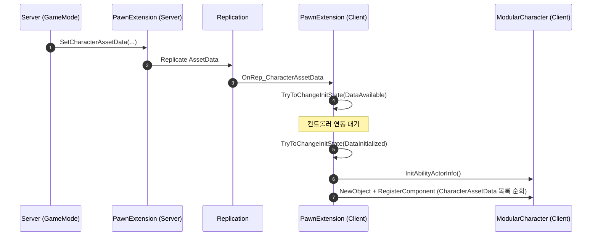

</details>

### 1-3. Enhanced Input × Gameplay Tag

> 언리얼 최신 입력 체계(Enhanced Input)와 Gameplay Tag 시스템을 융합해, 입력-스킬 바인딩을 데이터(`SpyInputConfig`)로 완전히 분리했습니다. 폰의 입력 바인딩 코드는 한 줄도 하드코딩하지 않고 `SpyEnhancedInputComponent`가 태그 기반으로 ASC에 직접 전달합니다.

<details>
<summary>자세히 보기</summary>

- **`SpyInputConfig` (DataAsset)**: `UInputAction` ↔ `GameplayTag`를 N:M 매핑으로 보관. 한 액션이 여러 어빌리티 태그를 발화시킬 수 있고, 그 반대도 가능.
- **`SpyEnhancedInputComponent`**: `BindActionByTag` 헬퍼로 InputAction의 Pressed/Released를 ASC `AbilityLocalInputPressed/Released`로 즉시 포워딩.
- **GA 부여 시 태그 주입**: `GiveAbility` 시점에 `DynamicAbilityTags`에 `Input.Ability.Skill.NN` 태그를 꽂아 ASC가 입력 → 어빌리티 매칭을 즉시 처리.

</details>

---

## 2. ⚡ GAS & 데이터 파이프라인

### 2-1. SKGAS 모듈 (커스텀 GAS 래퍼)

> 언리얼 기본 GAS를 프로젝트 비의존 별도 모듈(`SKGAS`)로 한 겹 래핑해, 어빌리티의 공통 로직(스킬 액션 / 이동기 / 큐 매니저)을 베이스 클래스 계층에 캡슐화했습니다. 단순 전투 스킬뿐 아니라 점프 · 파쿠르 · 죽음까지 게임 내 모든 상태 변화를 GA로 통일했습니다.

<details>
<summary>자세히 보기</summary>

- **모듈 구조**: `SKGameplayAbility` 베이스 → `SKGameplayAbility_SkillAction` → `SpyGameplayAbility_*` 구체 클래스 계층.
- **모든 게임플레이 로직의 GA화**: 캐릭터의 스탯 초기화 GA, 기본 점프 GA, 파쿠르 액션 GA(Vault / WallClimb / HangUp), 그래플링 GA, 패링 GA, 죽음 GA. 하드코딩된 캐릭터 로직 없음.
- **입력 버퍼링 + 태그 매핑**: `SKAbilitySystemComponent`에서 입력을 단순 enum이 아닌 캐싱된 핸들 배열 + Gameplay Tag로 처리. 태그 기반 매칭이라 어빌리티 부여/회수 시 자동 정합.

</details>

### 2-2. Data-Driven GiveAbility (USpyAbilityData)

> 어빌리티 부여를 코드 한 줄도 하드코딩하지 않고, `USpyAbilityData` DataAsset 하나에서 AttributeSet 동적 생성 + 초기 GE 적용 + GA 부여를 일괄 처리합니다. 발급된 모든 핸들은 `FSpyAbilitySet_GrantedHandles` 단위로 트래킹해 장착 해제·사망 시 메모리 누수를 차단합니다.

<details>
<summary>자세히 보기</summary>

- **`GiveToAbilitySystem()` 1회 호출 = 풀 세트업**: 내부적으로 배열을 순회하며 1) 없는 `AttributeSet` 동적 생성 및 추가, 2) 초기 `GameplayEffect` 자동 적용, 3) `GameplayAbility` 부여 시 `DynamicAbilityTags`에 인풋 태그 주입.
- **`FSpyAbilitySet_GrantedHandles` 트래킹**: 부여된 모든 어빌리티/이펙트/AttributeSet 핸들을 단일 구조체로 묶어 보관. 장착 해제 또는 사망 시 `TakeFromAbilitySystem()` 한 번으로 전부 정리.

```cpp
//# 사용 예: 캐릭터에 무기 어빌리티 세트 부여/해제
FSpyAbilitySet_GrantedHandles Handles;
WeaponAbilityData->GiveToAbilitySystem(ASC, &Handles, SourceObject);
//# ...
Handles.TakeFromAbilitySystem(ASC);
```

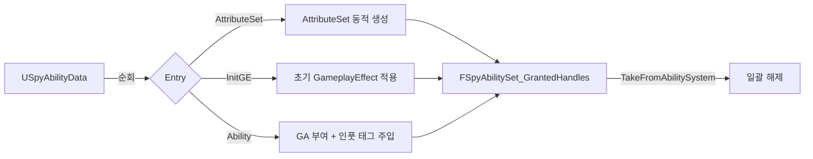

</details>

### 2-3. DataAsset 계층 + SpyAssetManager

> 모든 기획 요소(어빌리티 / 캐릭터 컴포넌트 / 콤보 / 애니메이션 레이어)를 `PrimaryDataAsset` 계층으로 분리하고, `SpyAssetManager`를 진실의 원천(Single Source of Truth)으로 두었습니다. 글로벌 코어 데이터만 시작 시 동기 로드하고 나머지는 시점에 따라 sync/async 메커니즘으로 제어합니다.

<details>
<summary>자세히 보기</summary>

- **DataAsset 계층**:
  - `USKAssetData` — 이름→경로 룩업 베이스
  - `USpyAssetData` — 전체 에셋 중앙 허브 (시작 시 동기 로드)
  - `USpyCharacterAssetData` — 캐릭터별 컴포넌트 목록 + 어빌리티 세트 + 입력 설정 + 콤보 데이터 + `TeamId`(§ 4-4)
  - `USpyAbilityData` — GAS 어빌리티/AttributeSet/GameplayEffect 묶음
  - `USpyComboAssetData` — `StartSkillTag → ComboTag` 딕셔너리
  - `USpyAnimAssetData` — AnimLayer 맵 (`FName → TSoftClassPtr`)
- **Config DataAsset**: `SpyAIConfig` / `SpyCharacterConfig` / `SpyInputConfig` / `SpyMovementConfig` — 하드코딩된 수치를 점진적으로 이전하는 중 (`docs/hardcoded-values.md`).
- **글로벌 필수 데이터 한정 동기 로드**: `PrimaryAssetTypesToScan`을 글로벌 코어 데이터로만 엄격히 제한, 시작 시 `LoadAllPrimaryAssetsSync`로 보장. 나머지는 `LoadAssetSync` / `LoadAssetAsync`로 시점 제어.
- **머지 충돌 회피 협업 규칙**: 팀원이 각자 개별 PrimaryDataAsset을 작성하고, 통합 시점에만 `SpyAssetData`에 등록하는 파이프라인. 바이너리 머지 충돌 최소화.

</details>

### 2-4. SKCueManager 비동기 프리로딩

> 런타임 빈발하는 이펙트·사운드용 큐(Cue) 액터의 첫 발동 히치(hitch)를 방지하기 위해, `SKCueManager`가 게임 시작 직후 사용 후보 큐들을 백그라운드로 프리로드하고, 풀(`SKCueActorPool`)에서 즉시 꺼내 재생하도록 설계했습니다.

<details>
<summary>자세히 보기</summary>

- **비동기 프리로딩**: 캐릭터/무기 데이터에 등록된 큐 후보들을 게임 시작 후 백그라운드 스레드에서 `LoadAssetAsync`로 미리 로드.
- **`SKCueActorPool` (재사용 풀)**: 재생 종료된 큐 액터를 파괴하지 않고 풀에 반환, 다음 발동 시 즉시 재사용.

</details>

---

## 3. 🏃 캐릭터 액션

### 3-1. 파쿠르 (Vault / WallClimb / HangUp)

> 단순한 충돌 판정이 아닌 다중 LineTrace로 장애물의 형태(법선·높이·두께·착지점)를 정밀하게 분석한 뒤, 결과를 `FMotionWarpingData`로 변환해 클라에 리플리케이트합니다. 모든 파쿠르 액션은 `GA_Vault` / `GA_WallClimb` / `GA_HangUp` GA로 캡슐화되어 있습니다.

**Vault**

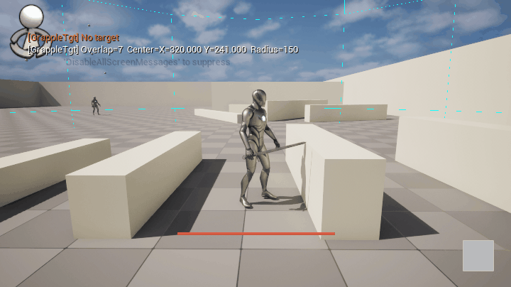

**Wall Climb → Hang Up**

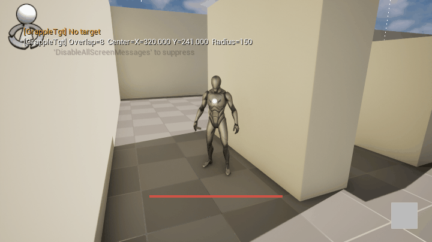

<details>
<summary>자세히 보기</summary>

- **`SpyParkourManagerComponent` (서버 분석)**:
  1. **전방 검출 (Forward Raycast)**: 캐릭터 전방 LineTrace로 벽 법선과 거리 추출.
  2. **높이/상단 표면 검출 (Top-Down Iteration)**: 벽 법선을 역산해 `RayInterval`마다 위→아래 LineTrace로 정확한 높이(`Height`)와 손 짚을 위치(`HitVector`) 산출.
  3. **깊이 식별 + 착지점 (Depth Check)**: 상단 LineTrace가 벽을 벗어난 시점을 감지해 역방향 LineTrace로 두께(`Depth`) 산출, 최종 착지점(`LandVector`) 도출.
- **GA 발동 흐름**: Vault와 Wall Climb는 **각자 별개 InputAction**으로 발동한다. 입력 시 `SpyParkourManagerComponent`의 `CanVaultAction()` / `TryToggleClimbAction()`이 자체 LineTrace로 지형 조건을 체크하고, 통과해야 `TryActivateAbility`. Hang Up만 별도 키 없이 — WallClimb 활성 중 `SpyCharacterMovementComponent::PhysCustom_WallClimb`가 `CanHangUp()` 충족 시 `Skill.Move.HangUp` GameplayEvent를 송신해 자동 시전.
- **Motion Warping 동기화**: 서버 계산 결과를 `OnRep_VaultMotionWarpingData` 등으로 클라에 푸시, 애니메이션 워핑 앵커가 도착 위치와 정합.

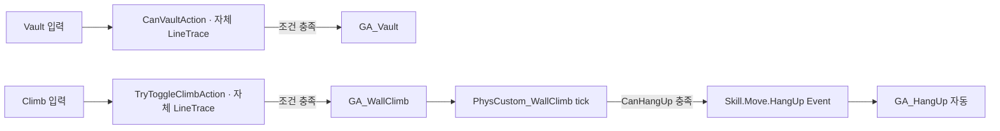

</details>

### 3-2. 데이터 지향 콤보 시스템

> 애니메이션 노티파이로 콤보 윈도우를 열고, `SpyComboAssetData` 딕셔너리에서 다음 GA를 색인해 즉시 발동합니다. "A 스킬 → B 스킬" 연계 공식이 코드가 아닌 데이터 에셋에 정의됩니다.


<details>
<summary>자세히 보기</summary>

- **`SpyAnimNotify_State_Combo`**: 공격 애니메이션의 허용 구간 동안 ASC에 `Character_State_Combo` Loose Tag를 부여/해제. AnimNotifyState 시작 시 `AddLooseGameplayTag`, 종료 시 `RemoveLooseGameplayTag`.
- **`SpyComboAssetData` (PrimaryDataAsset)**: `StartSkillTag → ComboTag` 1:1 매핑 딕셔너리.
- **작동 플로우**:
  1. 입력 시 ASC가 `Character_State_Combo` 태그를 보유 중인지 검증.
  2. 보유 시 가장 최근 시전된 스킬 태그를 키로 `SpyComboAssetData` 색인.
  3. 매핑된 ComboTag의 GA를 즉시 `TryActivateAbility`.
- 코드 변경 없이 데이터만 수정하면 콤보 트리가 바뀜.

</details>

### 3-3. 🆕 그래플링 훅 (타겟팅 + 케이블 + 공중 루프 + UI 프롬프트)

> 화면 중앙 근처의 `GrappleAnchor` 액터를 스캔해 베스트 타겟을 결정하고, GA 발동 시 빨간 케이블 액터가 손 본에서 타겟 위치로 펼쳐지며 캐릭터는 공중 자세 루핑 Montage로 매달린 채 끌려갑니다. `AbilityTask_GrappleTick`이 서버에서 도착 거리 체크를 수행하고 도착 시 GA를 종료해 자연 블렌드로 풀어줍니다.

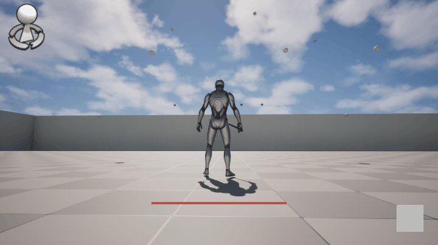

<details>
<summary>자세히 보기</summary>

- **`USpyGrappleTargetingComponent`**: `GrapplePromptRange` / `GrappleTargetingScreenRadius` (`SpyMovementConfig`)로 카메라 viewport 내 베스트 타겟 스캔. Delegate로 `OnTargetChanged` 통지.
- **`USpyGrappleUIComponent`**: 타겟 변경 시 `WBP_GrapplePrompt` 위젯 토글 + 타겟 액터 Highlight (스캔 중인 앵커가 한눈에 보임).
- **`USpyGA_GrappleHook` (LocalPredicted)**: 입력 → 타겟 조회(`GetGrappleTargetLocation`) → 서버에서 케이블 액터 스폰 → `SpyAbilityTask_GrappleTick` + `UAbilityTask_PlayMontageAndWait(AirLoopMontage)` 동시 시작. 양쪽(서버·로컬 클라)에서 Montage 재생, 시뮬 클라는 GAS 표준 Montage Replication으로 동기화.
- **`USpyAbilityTask_GrappleTick`**: 서버에서 캐릭터-타겟 거리 체크. 임계값 도달 시 GA 종료 + 상태 태그 정리 + Montage 자동 Stop(Task OnDestroy).
- **`AGrappleCableActor` (Replicated)**: `CableComponent` 플러그인 기반 시각화 액터. 손 본(`HandBoneName`) → 타겟 위치(`TargetLocation`)로 매 프레임 트랜스폼 갱신, 빨간 머티리얼 + `NumSegments` / `CableWidth`로 굵기 조절.
- **재누름 취소**: 그래플링 도중 다시 입력하면 GA가 즉시 종료되어 케이블·Montage·태그가 한 번에 정리됨.
- **태그**: `Skill.Move.GrappleHook` / `Character.State.Grapple` / `Lock.Input.Move` / `Input.Ability.Skill.11`.
- **방향 전환 지원**: 그래플링 도중 캐릭터가 타겟 방향으로 자연스럽게 회전.

```cpp
//# USpyGA_GrappleHook 핵심 흐름 (의사 코드)
const FVector Target = TargetingComponent->GetGrappleTargetLocation();
if (Target.IsZero() == false)
{
    SpawnCable(GetAvatarActor(), Target);
    UAbilityTask_GrappleTick* Task = NewAbilityTask<UAbilityTask_GrappleTick>(this);
    Task->OnArrived.AddDynamic(this, &ThisClass::OnGrappleArrived);
    Task->ReadyForActivation();
}
```

</details>

### 3-4. 🆕 홀드형 패링 시스템

> 패링 입력을 누르고 있는 동안 `Character_State_Parry` 태그가 유지되며, 이 윈도우 동안 들어온 정면 공격을 `SkillAction` 단계에서 차단하고 공격자에게 `Skill_Parry_Hit` 이벤트를 역송합니다.

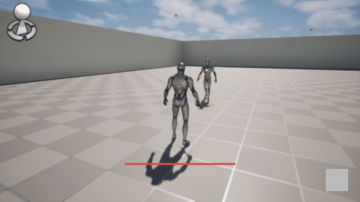

<details>
<summary>자세히 보기</summary>

- **`USpyGameplayAbility_Parry` (홀드형 GA)**: 입력 Pressed에서 ActivateAbility, Released에서 EndAbility. 활성 동안 ASC에 `Character_State_Parry` 태그 유지.
- **`SKGameplayAbility_SkillAction` 통합**: 공격자가 데미지를 가하기 직전에 타겟 ASC가 `Character_State_Parry` 태그를 보유 중이고 정면 각도(dot product) 안에 들어왔는지 검사 → 충족 시 데미지 무효화 + 공격자에게 `Skill_Parry_Hit` 게임플레이 이벤트 전송 + `bInvalidCharacter` 플래그 설정.
- **양쪽 카메라 쉐이크**: 패링 성공 시 패링한 측과 공격자 측 모두에게 카메라 쉐이크가 트리거되어 타이밍 성공 임팩트가 양쪽에 전달.
- **태그**: `Character.State.Parry` / `Skill.Parry.Hit` / `Input.Ability.Parry`.
- **null 안전성**: `SendTagToTargetByWeapon`은 `BySphere` 헬퍼와 동일한 null 처리 패턴을 따름 (TargetASC null 시 조용히 스킵).

</details>

### 3-5. 🆕 카메라 제어 (벽 가림 회피 + 피치 제한)

> 3인칭 카메라가 벽에 가려 캐릭터가 보이지 않거나, 시점이 비현실적으로 위/아래로 꺾이는 문제를 Config 기반으로 해결했습니다. SpringArm 충돌 테스트와 View Pitch 클램프를 `SpyCharacterConfig`로 노출해 데이터 수정만으로 캐릭터별 카메라 거동을 조정할 수 있습니다.


<details>
<summary>자세히 보기</summary>

- **SpringArm 자동 단축**: `CameraBoom->bDoCollisionTest = true`로 변경. 카메라와 캐릭터 사이에 벽이 들어오면 SpringArm이 자동으로 줄어들어 캐릭터가 가려지지 않음.
- **View Pitch 클램프 (Config 기반)**: `USpyCharacterConfig`에 `ViewPitchMin`(기본 -60°) / `ViewPitchMax`(기본 +60°) 필드 추가. `ClampMin/Max` 메타로 ±89.9° 안전 범위 강제.
- **Possession 시점 적용**: `ASpyPlayerController::AcknowledgePossession`에서 `SpyCharacter->GetCharacterConfig()`를 조회해 `PlayerCameraManager->ViewPitchMin/Max`에 주입. 캐릭터마다 다른 시점 제한을 데이터로 관리.

```cpp
//# SpyPlayerController::AcknowledgePossession 발췌
if (PlayerCameraManager)
{
    if (ASpyCharacter* SpyChar = Cast<ASpyCharacter>(InPawn))
    {
        if (USpyCharacterConfig* Config = SpyChar->GetCharacterConfig())
        {
            PlayerCameraManager->ViewPitchMin = Config->ViewPitchMin;
            PlayerCameraManager->ViewPitchMax = Config->ViewPitchMax;
        }
    }
}
```

</details>

---

## 4. ⚔️ 전투 / 인터랙션  🆕

### 4-1. 타겟팅 매니저

> `SpyTargetingManagerComponent`가 캐릭터 주변/시야 안에 있는 적 후보를 추적하고, GA 시점에 즉시 베스트 타겟을 제공합니다. 그래플링 타겟팅(§ 3-3)과는 별개의 전투 전용 매니저입니다.


<details>
<summary>자세히 보기</summary>

- **별도 컴포넌트로 분리**: 그래플링 전용(`SpyGrappleTargetingComponent`)과 전투 전용(`SpyTargetingManagerComponent`)을 분리해 책임을 명확히. 두 컴포넌트는 서로 의존하지 않음.
- **GA 통합**: `SKGameplayAbility_SkillAction` 등 공격성 GA가 발동 시 매니저에게 베스트 타겟을 질의. 타겟 부재 시에도 어빌리티 활성은 유지(미스/공중 공격 허용).

</details>

### 4-2. 무기 AnimTrail 이펙트

> `GA_Skill` 발동 시 `SpyWeapon`이 무기 메시에 부착된 소켓 사이로 AnimTrail 파티클을 생성해 검격 잔상을 표현합니다. 데이터 지향으로 무기 에셋(`USkeletalMesh`)에 트레일 설정을 보관합니다.


<details>
<summary>자세히 보기</summary>

- **트레일 발동 트리거**: GA 활성 시점에 `SpyWeapon`이 트레일 컴포넌트를 활성화, 종료 시점에 비활성화.
- **무기 에셋 통합**: 무기별 트레일 머티리얼/소켓 페어를 `SpyWeapon` BP CDO 또는 무기 데이터에 보관해 코드 수정 없이 무기마다 다른 잔상 가능.

</details>

### 4-3. 히트 카메라 셰이크

> 데미지 적중 시 공격자/피격자에게 강도가 다른 카메라 셰이크를 적용해 타격감을 강화합니다. 클라이언트 연출이므로 GA의 권한 블록 밖에서 처리됩니다.

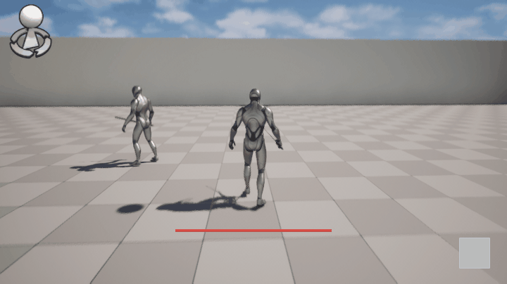

<details>
<summary>자세히 보기</summary>

- **공격자/피격자 분리**: 공격자에게는 가벼운 임팩트 셰이크, 피격자에게는 강한 셰이크 + 시간 보정.
- **클라이언트 연출 패턴**: 셰이크는 클라 전용이므로 GA `HasAuthority` 분기 밖에서 `PlayerController->ClientStartCameraShake()` 호출.
- **로컬 컨트롤러 RPC 우회**: 서버 호스트 자신이 피격자인 경우 Client RPC 경로 대신 로컬 직접 호출로 전환해, 호스트 화면에서 셰이크가 누락되던 케이스 해결.
- **GA 차단 무관 트리거**: 카메라 쉐이크 트리거를 `SpyHealthComponent`의 데미지 수신 경로로 옮겨, 패링·무적 등으로 GA가 차단되어도 피격 연출이 정상 발동.

</details>

### 4-4. 팀 시스템 (TeamId)

> `FCharacterAssetEntry`에 `TeamId` 필드를 도입해 캐릭터 클래스 단위로 팀 번호를 관리합니다. 기본값 `NoTeam(255)`로, 데이터 미설정 시 의도치 않은 아군 판정이 발생하지 않도록 설계했습니다.

<details>
<summary>자세히 보기</summary>

- **`FCharacterAssetEntry::TeamId`**: 캐릭터 에셋 엔트리당 팀 번호 1바이트.
- **기본값 `NoTeam(255)`**: 명시적으로 팀이 설정되지 않은 캐릭터는 어떤 팀과도 같은 팀이 아님. 우발적 아군 판정 방지.
- **경고 로그**: 엔트리 자체가 없는 경우 경고 로그를 출력해 데이터 누락을 빠르게 감지.
- **GA 통합**: 데미지/회복 GA가 타겟의 `TeamId`를 조회해 아군/적군 분기.

</details>

---

## 5. 🤖 AI 시스템  🆕

### 5-1. Behavior Tree Tasks + Kiting 사이클

> 모든 AI 행동을 GA로 통일한 프로젝트 철학에 맞춰, BT의 끝단 Task가 직접 로직을 작성하지 않고 `BTTask_ActivateAbility`로 GA를 발화시키는 구조를 채택했습니다. 추격 → 사거리 진입 → 어빌리티 발동 → EQS 후퇴로 이어지는 **Kiting 사이클**로 단순 돌격 AI에서 벗어나 거리 유지형 액션 AI를 구현했습니다.

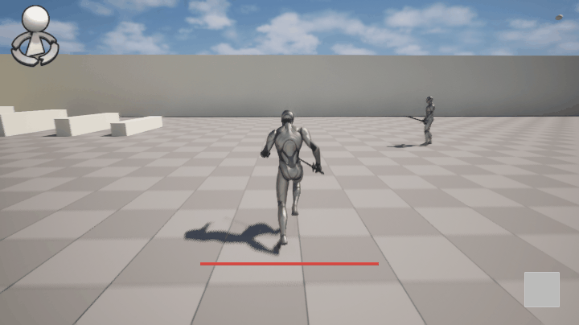

<details>
<summary>자세히 보기</summary>

- **`BTTask_ActivateAbility`**: BB의 어빌리티 태그를 입력 받아 ASC `TryActivateAbilitiesByTag` 호출. AI 행동 = GA 호출이 1:1로 매핑.
- **`BTTask_MoveToTarget`**: BB의 타겟 액터를 향한 이동. AIController 표준 `MoveTo`를 직접 사용하지 않고 거리·재경로 산출·타임아웃 처리를 자체 관리해 추격 정확도와 안정성을 강화.
- **`BTTask_CircleStrafe`**: 타겟 주위로 좌/우 회피 이동. EQS 컨텍스트(§ 5-2)에서 결정된 방향을 따라 회전 반경을 유지하며 측면 이동.
- **`BTTask_FindRandomPos`**: 정찰용 랜덤 위치 결정.
- **`BTService_CheckCooldown`**: 어빌리티 쿨다운을 BB 변수로 동기화. BT가 사용 가능 어빌리티만 선택하도록 필터.
- **`SpyAIController` 안정화**:
  - 타겟 사망 시 살아있는 적으로 자동 전환 — 사망한 타겟에 묶여 멈추는 현상 방지.
  - 자신이 사망한 후에도 회전이 지속되던 문제 수정 — 사망 후에는 컨트롤 회전을 강제 해제.
  - `Lock.Input.Move` 태그(스킬 시전 락) 보유 중에는 타겟 회전을 차단해 시전 직전의 스냅 회전을 방지.

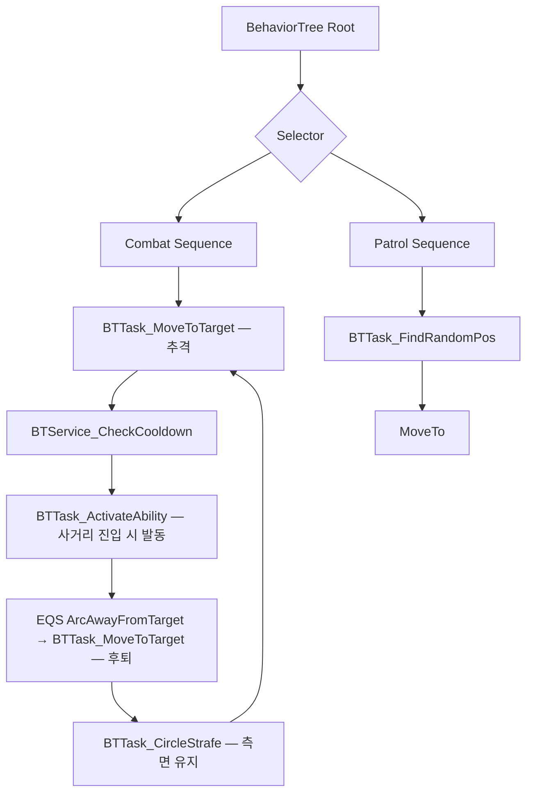

</details>

### 5-2. EQS + StrafeDirection / ArcAwayFromTarget

> 회피 방향과 후퇴 위치 결정에 EQS(Environment Query System)를 도입했습니다. 좌/우 회피는 `StrafeDirection` 컨텍스트로, 어빌리티 사용 후 후퇴는 자체 작성한 `EnvQueryGenerator_ArcAwayFromTarget`으로 타겟 반대 방향 호(arc) 위 지점을 평가해 가장 유리한 쪽을 선택합니다.


<details>
<summary>자세히 보기</summary>

- **`EnvQueryContext_StrafeDirection`**: AI에게 좌/우 회피 후보 지점을 생성/평가하기 위한 컨텍스트. 캐릭터-타겟 벡터 기준 좌/우 지점을 BB 변수로 노출.
- **`EnvQueryContext_TargetActor`**: BB의 `TargetActor`를 EQS 컨텍스트로 노출해 타겟 좌표·방향을 모든 EQS 쿼리에서 참조 가능.
- **`EnvQueryGenerator_ArcAwayFromTarget` (커스텀 Generator)**: Querier 위치를 중심으로 타겟의 반대 방향을 향한 호(`ArcAngleDegrees`) 위에 점(`NumPoints`)을 균등 생성, NavMesh로 투영. `Radius`는 후퇴 거리(기본 150cm)이며 짧은 사이드 스텝/백 스텝 회피용.
- **EQS 관련 BB 변수**: `StrafeTargetLocation`, `StrafeDirection`, `RetreatLocation` 등 EQS 결과 저장용.
- **AI 행동 결과**: 단순한 정면 돌격이 아닌, 사이드 스텝하면서 거리 유지 + 어빌리티 발동 + 후퇴로 이어지는 전형적인 액션 게임 AI 패턴 구현.

</details>

### 5-3. SpawnBot 매니저

> `SpySpawnBotManagerComponent`가 레벨 내 봇 스폰 위치/타이밍/카운트를 중앙에서 관리합니다. 게임 모드와 분리된 컴포넌트로 두어, 다른 게임플레이 모드에서도 재사용 가능합니다.

<details>
<summary>자세히 보기</summary>

- **컴포넌트 기반 책임 분리**: GameMode에 봇 로직을 하드코딩하지 않고 컴포넌트로 추출. 다른 게임 모드에 부착만 하면 동일 기능 사용.
- **데이터 주입**: 스폰 캐릭터 클래스/위치/카운트는 데이터 에셋이나 컴포넌트 디테일 패널에서 설정 가능.

</details>

---

## 6. 🧰 에디터 툴체인 & 워크플로우  🆕

### 6-1. SpyDataEditorTool — 3탭 데이터 일괄 편집기

> `Content/Spy/Data/`의 모든 DataAsset을 한 곳에서 일괄 편집하기 위한 별도 에디터 모듈. Assets / Ability / Config 3탭으로 책임을 분리했고, **Scan → 검토/편집 → Apply** 흐름을 따릅니다.

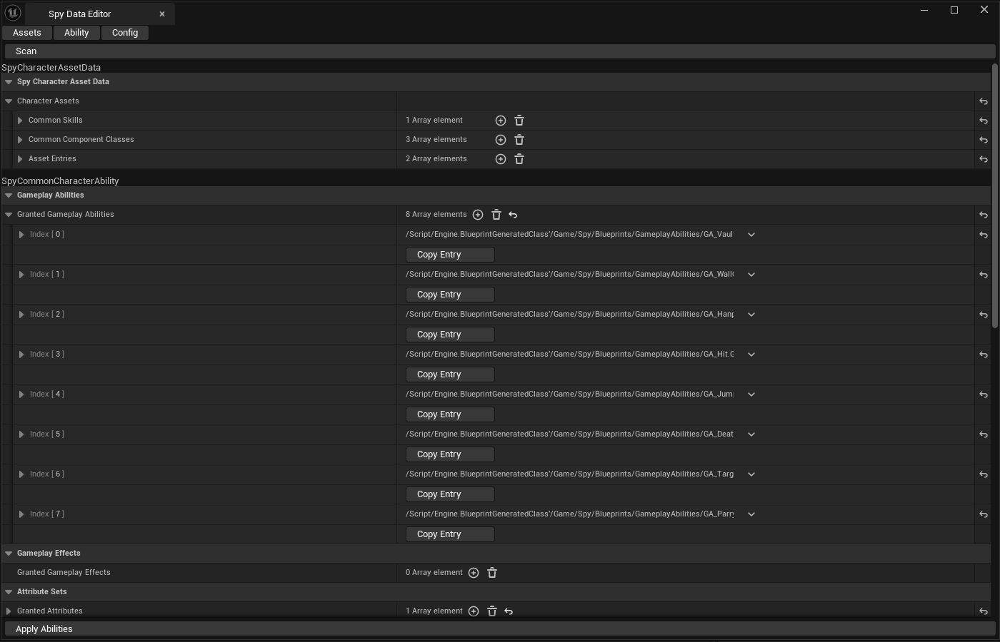

<details>
<summary>자세히 보기</summary>

- **`SpyDataEditorTool` (Editor 모듈, `PostEngineInit` 로드)**: 별도 메뉴 항목으로 NomadTab을 띄우고 Slate UI로 편집.
- **3개 탭**:
  - `SSpyAssetsTab` — 전체 에셋 중앙 허브(`SpyAssetData`) 편집
  - `SSpyAbilityTab` — 어빌리티 데이터(`SpyAbilityData`) 편집
  - `SSpyConfigTab` — Config DataAsset(`SpyAIConfig` / `SpyCharacterConfig` / `SpyInputConfig` / `SpyMovementConfig`) 편집
- **`SpyDataScanner` 자동 스캔**: 새 에셋 타입 추가 시 스캐너에 등록만 하면 탭 자동 갱신.
- **`IDetailCustomization` / `IPropertyTypeCustomization`**: 일부 복잡한 구조체에 커스텀 디테일 패널 적용.

</details>

### 6-2. SpyGACreatorTool — GA Blueprint 원클릭 생성

> Window 메뉴에 추가된 "Spy GA Creator" 탭에서 부모 클래스/이름/GAS 기본 설정을 입력하고 버튼 한 번이면 `/Game/Spy/Blueprints/GameplayAbilities/GA_<Name>.uasset` Blueprint가 생성되고 에디터가 자동으로 열립니다.

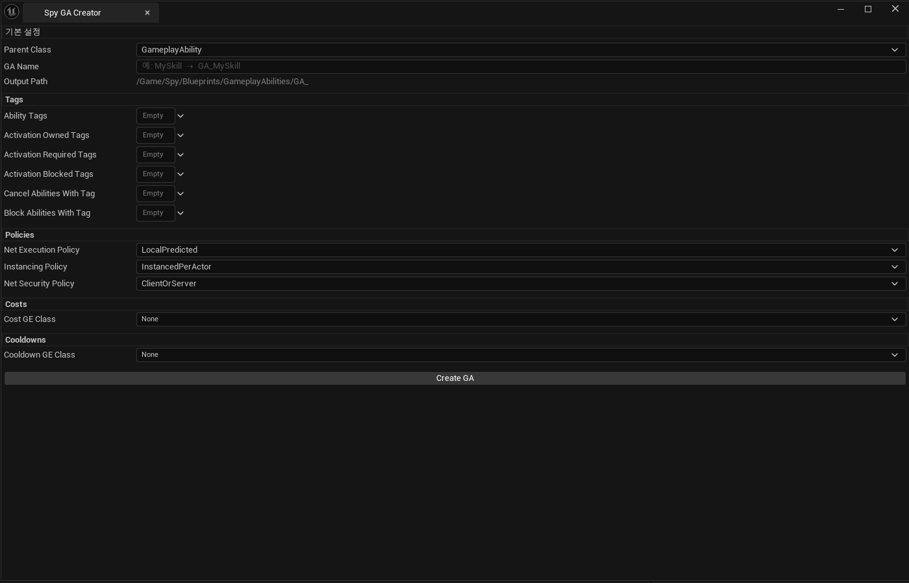

<details>
<summary>자세히 보기</summary>

- **`SpyGACreatorTool` (Editor 모듈, `PostEngineInit` 로드)**: `SpyDataEditorTool`과 의존성 분리된 별도 에디터 모듈.
- **`SSpyCreateGADialog` (Slate)**: 부모 클래스 콤보 박스 + GA 이름 입력 + GAS 옵션 체크박스(`bReplicateAbility`, `Net Execution Policy` 등) 폼.
- **에셋 생성 파이프라인**:
  1. 입력 검증(이름 중복/금지 문자).
  2. `KismetCompilerUtilities::CreateBlueprint`로 GA Blueprint 생성.
  3. CDO에 GAS 기본 설정 주입.
  4. `AssetEditorSubsystem::OpenEditorForAsset` 호출로 새 BP 자동 오픈.

</details>

### 6-3. Unreal MCP 서버 — Python 원격 제어

> `tools/unreal-mcp/` 디렉터리의 Python MCP(Model Context Protocol) 서버를 통해 외부 LLM 도구가 Unreal Editor를 원격 제어할 수 있습니다. 에셋 스캔 / Blueprint CDO 수정 / Spy DataAsset CRUD / 액터 스폰 / Python 임의 실행 등 도구 함수를 노출합니다.

<details>
<summary>자세히 보기</summary>

- **구조**: `server.py` (MCP 진입점) + `unreal_client.py` (RemoteControl HTTP 브리지) + `tools/` (도구 함수 모음).
- **노출 도구 카테고리**:
  - `asset_tools` — `list_assets`, `find_assets_by_class`, `get_asset_properties`, `set_asset_property`, `save_asset`
  - `blueprint_tools` — `get_blueprint_cdo_properties`, `set_blueprint_cdo_property`
  - `spy_asset_tools` — `get_spy_asset_data`, `save_spy_asset_data`, `add/remove/set_asset_entry`, `add/remove_asset_group`
  - `ability_data_tools` — `get_ability_data`, `add/remove/set_anim_layer`
  - `combo_asset_tools` — `get_combo_asset_data`, `add/remove_combo_set`
  - `character_asset_tools` — `get_character_asset_data`
  - `anim_asset_tools` — `get_anim_asset_data`
  - `actor_tools` — `get_actors_in_level`, `spawn_actor`, `delete_actor`, `get/set_actor_property`
  - `python_exec_tools` — `execute_python` (안전망 래퍼 포함 임의 Python 실행)
- **연결 방식**: `RemoteControl` 플러그인이 Unreal HTTP API를 노출, Python 클라이언트가 그 위에 MCP 추상화 레이어 제공.

</details>

### 6-4. 🆕 SpyTagManagerTool — Gameplay Tag 직접 편집기

> `SpyGameplayTags.h` / `.cpp` 파일을 직접 파싱·편집하는 에디터 탭입니다. 트리 뷰로 전체 태그 계층을 시각화하고, 그룹 선택 + 부모 경로 + 복수 리프 입력으로 여러 태그를 한 번에 추가할 수 있습니다.

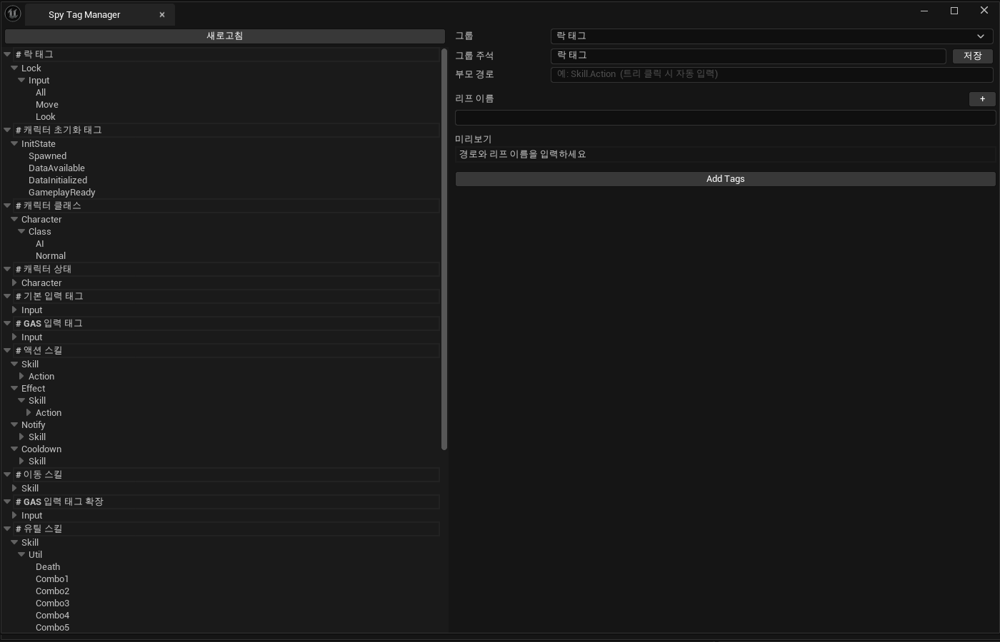

<details>
<summary>자세히 보기</summary>

- **`SpyTagManagerTool` (Editor 모듈)**: Level Editor 상단 메뉴 `Spy Tools → Spy Tag Manager`에서 NomadTab으로 열림.
- **`SSpyTagManagerDialog` (Slate)**: 좌측 트리 뷰(그룹 계층 시각화) + 우측 추가 패널(그룹 콤보박스 / 부모 경로 / 그룹 주석 / 리프 입력 행 다중 추가)로 구성.
- **`FSpyTagFileEditor`**: `SpyGameplayTags.h`와 `.cpp`를 직접 파싱해 그룹 + `VarName` + `TagString`을 추출. 중복 체크 후 `AppendTags`로 파일에 직접 기록.
- **그룹 주석 인라인 편집**: 트리에서 그룹 헤더 클릭 시 우측 패널의 콤보박스·주석 텍스트가 자동 동기화. 수정 후 저장 버튼 한 번으로 h/cpp 파일 내 `//#` 주석 줄을 교체(`FSpyTagFileEditor::RenameGroup`).
- **플로우**: Refresh(파일 파싱) → 트리 검토 → 그룹·리프 입력 → 추가(중복 체크) → h/cpp 파일 직접 갱신.

</details>

### 6-5. 🆕 SKDebug — `spy.DebugDraw` 일괄 토글 CVar

> 파쿠르·타겟팅·CircleStrafe·SkillAction 등 곳곳에 흩어진 `DrawDebug*` / 진단 `UE_LOG` / `AddOnScreenDebugMessage`를 단일 콘솔 변수로 일괄 켜고 끕니다. 시연 시에는 끄고, 디버깅 시에는 한 줄로 켤 수 있습니다.

<details>
<summary>자세히 보기</summary>

- **`SKGAS_API bool SpyDebugDrawEnabled()`**: 모든 시각 디버그 코드가 이 함수를 분기 조건으로 사용. CVar `spy.DebugDraw 1 / 0`로 토글.
- **적용 지점**: `SKGameplayAbility_SkillAction`, `SpyAbilityTask_GrappleTick`, `SpyCharacterMovementComponent`, `SpyGrappleTargetingComponent`, `SpyParkourManagerComponent`, `SpyTargetingManagerComponent`, `BTTask_CircleStrafe`.
- **이전 상황**: 디버그 시각화가 항상 켜져 있어 패키징 빌드/시연 영상에 불필요한 라인이 노출되거나, 끄려면 각 파일을 일일이 주석 처리해야 했음. CVar 도입 후 `~ spy.DebugDraw 0` 한 줄로 정리.

</details>

---

# 📎 부록

## A. 빌드 방법

1. `SkillProject/SkillProject.uproject` 우클릭 → **Generate Visual Studio project files**.
2. 생성된 `SkillProject/SkillProject.sln`을 Visual Studio로 열기.
3. 솔루션 빌드 후 Unreal Editor 실행.
4. 새 C++ 클래스 추가 후에는 Editor의 **Tools > Refresh Visual Studio Project** 실행 또는 1번 단계 재수행.

## B. 모듈 의존 그래프

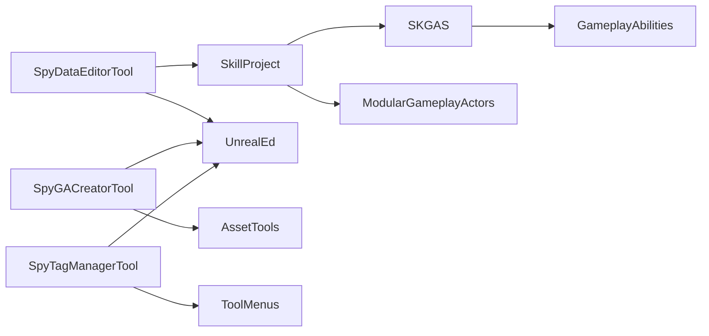

- `SkillProject` (Runtime) — 게임 로직 메인 모듈, `SKGAS`와 `ModularGameplayActors` 플러그인에 의존.
- `SKGAS` (Runtime) — 프로젝트 비의존 GAS 래퍼 모듈.
- `SpyDataEditorTool` (Editor) — `SkillProject` + 에디터 전용 모듈에 의존.
- `SpyGACreatorTool` (Editor) — `SpyDataEditorTool`과 코드/의존 분리된 별도 에디터 모듈.
- `SpyTagManagerTool` (Editor) — `SkillProject`에 비의존. `UnrealEd` / `ToolMenus`만 참조해 태그 파일을 직접 파싱·편집.

## C. 폴더 구조

```
SkillProject/
├── SkillProject.uproject              # 엔진 버전 / 모듈 / 플러그인 등록
├── SkillProject.sln                   # Visual Studio 솔루션
└── Source/
    ├── SKGAS/                         # 범용 GAS 래퍼 (Runtime, 프로젝트 비의존)
    │   ├── Ability/                   # SKGameplayAbility 베이스 계층
    │   ├── Attribute/                 # SKAttributeSet 베이스
    │   └── Cue/                       # SKCueManager / SKCueActorPool
    ├── SkillProject/                  # 게임 로직 메인 (Runtime)
    │   ├── AbilitySystem/
    │   │   ├── Calculation/           # GE 계산 클래스
    │   │   ├── Movement/              # GA_Jump / GA_WallClimb / GA_GrappleHook 등
    │   │   ├── Parry/                 # SpyGameplayAbility_Parry
    │   │   └── Skill/                 # SkillAction / SkillHit / Death / Targeting / Move
    │   ├── AI/                        # BTTask_*, BTService_*, EQS Context, AIUtils, Tests
    │   ├── Character/                 # SpyCharacter + 컴포넌트
    │   ├── Data/                      # 모든 DataAsset 클래스 정의 + Config DataAsset
    │   ├── Input/                     # Enhanced Input + 태그 바인딩
    │   ├── Item/                      # SpyWeapon
    │   ├── Manager/                   # SpyAssetManager / SpyUIManager
    │   ├── ManagerComponent/          # Parkour / Anim / Targeting / Grapple* / SpawnBot
    │   ├── System/                    # GameMode / GameState / PlayerController / PlayerState
    │   ├── UI/                        # HUD / Widget
    │   └── Util/                      # DefineEnum.h / SpyGameplayTags
    ├── SpyDataEditorTool/             # 데이터 일괄 편집기 (Editor)
    │   ├── Public/  Private/
    │   ├── Tabs/                      # SSpyAssetsTab / SSpyAbilityTab / SSpyConfigTab
    │   ├── Customizations/            # IDetailCustomization / IPropertyTypeCustomization
    │   └── Utils/                     # SpyDataScanner / SpyEditorUtils
    ├── SpyGACreatorTool/              # GA Blueprint 원클릭 생성 (Editor)
    │   ├── Public/ (SpyGACreatorTool.h / SSpyCreateGADialog.h)
    │   └── Private/
    ├── SpyTagManagerTool/             # Gameplay Tag 직접 편집기 (Editor)
    │   ├── Public/
    │   │   ├── SpyTagManagerTool.h    # 모듈 / Spy Tools 메뉴 등록
    │   │   ├── SSpyTagManagerDialog.h # Slate 트리 뷰 + 추가 패널
    │   │   └── SpyTagFileEditor.h     # h/cpp 파일 파서 + AppendTags / RenameGroup
    │   └── Private/
    └── Plugins/
        └── ModularGameplayActors/     # 에픽 ModularGameplay 통합 플러그인

tools/
└── unreal-mcp/                        # Python MCP 서버 (외부 LLM ↔ Unreal Editor 브리지)
    ├── server.py                      # MCP 진입점
    ├── unreal_client.py               # RemoteControl HTTP 브리지
    └── tools/                         # 카테고리별 도구 함수 (asset/blueprint/spy_asset/...)

docs/
├── hardcoded-values.md                # Config DataAsset 이전 대상 매직 넘버/문자열 정리
├── gifs/                              # README용 동영상 GIF (파쿠르·콤보·그래플링·패링·트레일·AI Kiting)
├── images/                            # README용 정지 스크린샷 (에디터 툴 화면 등)
└── superpowers/
    ├── plans/                         # superpowers writing-plans 산출물
    └── specs/                         # superpowers brainstorming 산출물 (디자인 스펙)
```
