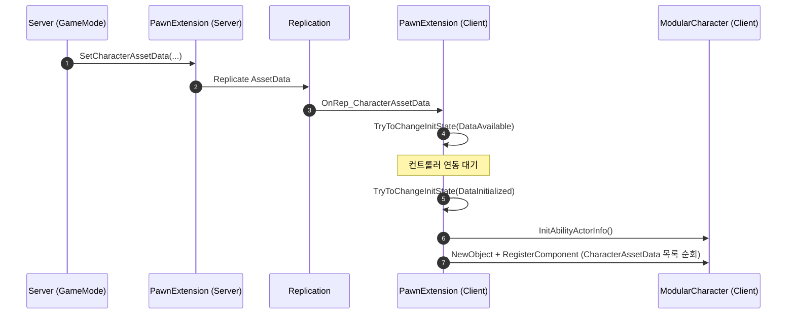
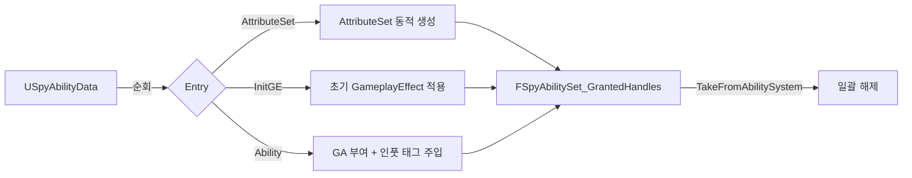
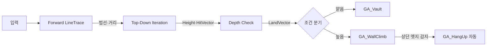
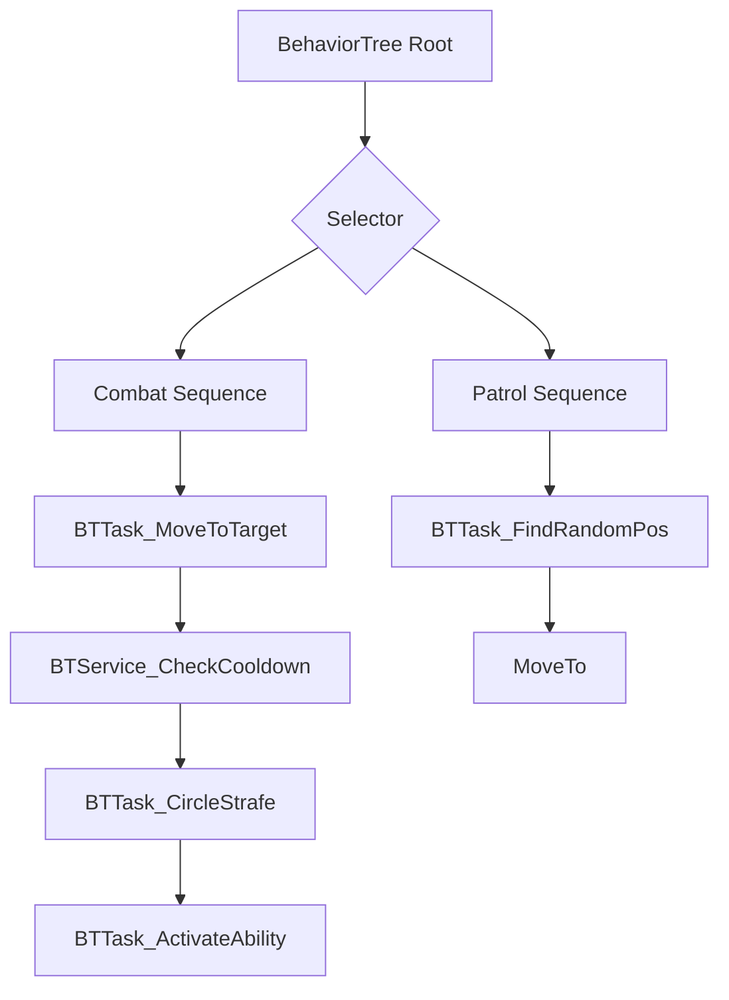
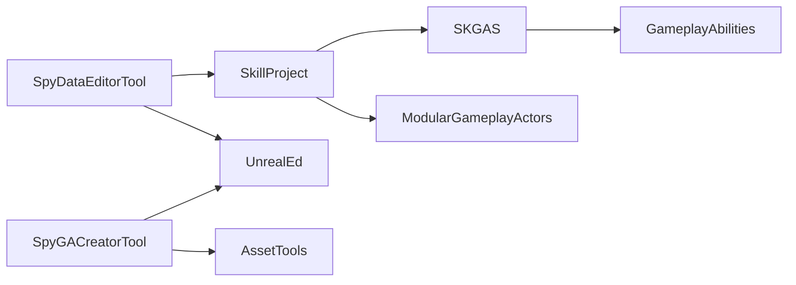

# README 리뉴얼 Implementation Plan

> **For agentic workers:** REQUIRED SUB-SKILL: Use superpowers:subagent-driven-development (recommended) or superpowers:executing-plans to implement this plan task-by-task. Steps use checkbox (`- [ ]`) syntax for tracking.

**Goal:** 기존 UE 5.4 기준의 `README.md`를 UE 5.7 + 신규 시스템(그래플링·패링·AI/EQS·전투 인터랙션·에디터 툴체인) 반영한 포트폴리오 쇼케이스 형태로 전면 교체한다.

**Architecture:** 단일 파일(`README.md`) 전면 교체. 상단 = 한 줄 카피 + 배지 + 인트로 + Showcase + 셀링포인트. 본문 = 6개 카테고리 각각 1문단 요약 + `<details>` 토글로 상세 펼침. 부록 = 빌드 / 모듈 그래프 / 폴더 트리. Mermaid 다이어그램·C++ 스니펫·GIF 플레이스홀더 적극 활용.

**Tech Stack:** Markdown(GitHub Flavored), Mermaid(GitHub 네이티브), shields.io 배지, HTML `<details>` 토글.

**Spec:** `docs/superpowers/specs/2026-04-30-readme-renewal-design.md`

**Commit policy:** 본 plan의 각 Task 끝에 Commit step이 있더라도, **사용자가 명시적으로 커밋을 요청한 경우에만 실행**한다. 그 전까지는 작업 결과만 디스크에 보존하고 commit은 보류한다.

---

## File Structure

| 파일 | 작업 | 설명 |
|---|---|---|
| `README.md` | **전면 교체** | 한 파일에 모든 결과 작성. 작업은 Task별로 Edit 누적 또는 1회 Write + 부분 Edit. |
| 새 파일 | 없음 | 별도 영문판/스크린샷 등 비목표 (spec § 1.3) |

**작성 전략:** Task 1에서 `Write`로 헤더만 들어간 빈 골격 파일을 생성하고, Task 2~9에서 `Edit`로 새 섹션을 끝에 append. 마지막 Task 10에서 검증.

---

## Task 1: 헤더 (제목 + 카피 + 배지 + 인트로)

**Files:**
- Create: `README.md` (기존 파일 백업 후 새로 작성)

- [ ] **Step 1: 기존 README 백업 확인 (git이 이미 추적 중이므로 별도 파일 백업 불필요)**

Run: `git -C D:/UnrealSkillProject status README.md`
Expected: README.md가 추적 중인 파일로 표시됨. (수정 시 git diff로 비교 가능)

- [ ] **Step 2: README.md 새로 작성 — 헤더 섹션만**

`Write`로 README.md 전체 덮어쓰기. 첫 작성이므로 이 시점엔 헤더만 넣고 나머지는 후속 Task에서 append.

```markdown
# UnrealSkillProject : Spy Project

*UE 5.7 · Dedicated Server · 커스텀 GAS · 모듈형 아키텍처 — 확장 가능한 멀티플레이어 액션 프레임워크.*

[]()
[]()
[]()
[]()
[]()

이 프로젝트는 언리얼 엔진 5.7 기반 스파이 테마 3인칭 액션 게임입니다.
완벽한 멀티플레이 동기화를 목표로 데디케이티드 서버(Dedicated Server) 환경에서 동작하며,
Lyra 스타일의 모듈형 아키텍처, 자체 래핑한 SKGAS 프레임워크,
그리고 모든 기획 데이터를 DataAsset으로 분리한 데이터 지향 설계(Data-Oriented Design)를 통해
확장성과 유지보수성을 극대화했습니다.

파쿠르 · 콤보 · 그래플링 훅 · 패링 등 모든 캐릭터 액션은
Gameplay Ability(GA) 단위로 캡슐화되어 서버 권한(Server Authority) 위에서 동기화됩니다.

---
```

- [ ] **Step 3: 헤더 구조 검증**

Run: `head -20 D:/UnrealSkillProject/README.md`
Expected:
- 첫 줄에 `# UnrealSkillProject : Spy Project`
- 두 번째 단락에 한 줄 카피 (D안)
- 5개 shields.io 배지가 한 블록에 모여 있음
- 2 문단 인트로 (인트로 1: 5줄, 인트로 2: 2줄)

- [ ] **Step 4: 백틱·괄호 병기·UE 버전 표기 검증**

Run: `grep -n "5.4" D:/UnrealSkillProject/README.md`
Expected: 결과 없음 (UE 5.4 잔재 0).

Run: `grep -n "5.7" D:/UnrealSkillProject/README.md`
Expected: 최소 2회 (한 줄 카피 + 인트로 단락).

- [ ] **Step 5: Commit (사용자 명시 요청 시에만)**

```bash
git -C D:/UnrealSkillProject add README.md
git -C D:/UnrealSkillProject commit -m "[Docs] README — 전면 리뉴얼: 헤더(타이틀/카피/배지/인트로) 작성"
```

---

## Task 2: 🎬 Showcase + ✨ 핵심 셀링포인트

**Files:**
- Modify: `README.md` (Task 1 끝에 append)

- [ ] **Step 1: Showcase 섹션 작성**

`README.md` 끝에 Edit로 다음 블록을 append:

```markdown
## 🎬 Showcase

> 시스템별 데모 영상은 추후 추가 예정입니다.

<!-- TODO: GIF — 파쿠르 (Vault / WallClimb / HangUp) 콤보 시연 -->
**🏃 파쿠르** — 다중 LineTrace 기반 지형 분석 + Motion Warping 매칭

<!-- TODO: GIF — 데이터 지향 콤보 (3타 이상 콤보 사이클) -->
**⚔️ 콤보** — `SpyComboAssetData` 딕셔너리 기반 GA 체인

<!-- TODO: GIF — 그래플링 훅 발사 → 케이블 → 도착 -->
**🪝 그래플링 훅** — 타겟 스캔 + 케이블 시각화 + 서버 도착 판정

<!-- TODO: GIF — 패링 윈도우 → 정면 공격 차단 → Skill_Parry_Hit -->
**🛡️ 패링** — 홀드형 GA + AnimNotifyState 기반 윈도우

<!-- TODO: GIF — AI EQS CircleStrafe + BTTask_ActivateAbility -->
**🤖 AI 전투** — Behavior Tree + EQS 기반 회피·전략 위치 선정

---
```

- [ ] **Step 2: 핵심 셀링포인트 섹션 작성 (5개 bullet — 1·3·4·7·8)**

`README.md` 끝에 Edit로 다음 블록을 append:

```markdown
## ✨ 핵심 셀링포인트

- **모든 캐릭터 액션이 GA** — 점프 · 파쿠르 · 콤보 · 그래플링 · 패링 · 죽음까지 전부 Gameplay Ability로 캡슐화. 하드코딩 0, 서버 동기화 자동.
- **Data-Driven 파이프라인** — `USpyAbilityData` 하나로 AttributeSet 동적 생성 + 초기 GE 적용 + GA 부여 일괄 처리, 핸들 트래킹으로 메모리 누수 차단.
- **InitState 기반 안전한 초기화** — GameFeature 의존 없이 `IGameFrameworkInitStateInterface`로 서버-클라 초기화 동기화, 컴포넌트 런타임 동적 주입.
- **AI + EQS 전투** — Behavior Tree Tasks(`BTTask_ActivateAbility` / `BTTask_CircleStrafe`) + EQS `EnvQueryContext_StrafeDirection`으로 회피·전략적 위치 선정.
- **자체 에디터 툴체인** — `SpyDataEditorTool` 3탭 데이터 편집기 + `SpyGACreatorTool` 원클릭 GA 생성 + Python MCP 서버로 에디터 원격 제어.

---

# 🛠️ 시스템 아키텍처

```

- [ ] **Step 3: GIF 플레이스홀더 개수·셀링포인트 위치 검증**

Run: `grep -c "TODO: GIF" D:/UnrealSkillProject/README.md`
Expected: `5` (Showcase 5개)

Run: `grep -n "핵심 셀링포인트" D:/UnrealSkillProject/README.md`
Expected: 단일 라인. 라인 번호가 README 상단 60줄 안에 위치 (spec § 7 검수 항목).

- [ ] **Step 4: Commit (사용자 명시 요청 시에만)**

```bash
git -C D:/UnrealSkillProject add README.md
git -C D:/UnrealSkillProject commit -m "[Docs] README — Showcase + 핵심 셀링포인트 섹션 추가"
```

---

## Task 3: § 1 코어 프레임워크 (3 하위)

**Files:**
- Modify: `README.md` (append)

- [ ] **Step 1: § 1 헤더 + 1-1 데디케이티드 서버 멀티플레이어 작성**

`README.md` 끝에 Edit로 append:

```markdown
## 1. 🌐 코어 프레임워크

### 1-1. 데디케이티드 서버 멀티플레이어

> 모든 게임플레이 로직(파쿠르 · 콤보 · 스킬 · 모션 워핑 데이터)은 서버 권한 위에서 실행되고, 클라이언트에는 리플리케이션으로 전달됩니다. GA 내부에서 `HasAuthority()` 체크 패턴을 강제하여 클라이언트 예측 실수에 의한 동기화 깨짐을 원천 차단했습니다.

<details>
<summary>자세히 보기</summary>

- **서버 권한 모델**: 게임플레이 상태 변경(데미지·이동·태그)은 모두 서버에서 실행하고 결과만 클라에 리플리케이트. GA `ActivateAbility`의 첫 줄에 `HasAuthority(&ActivationInfo)` 체크 후 서버 전용 로직과 클라 포함 연출을 분리.
- **Motion Warping 동기화**: 서버에서 계산한 파쿠르·그래플링 위치 데이터를 `FMotionWarpingData`로 변환 → `OnRep_*MotionWarpingData`로 클라에 푸시 → 클라는 도착한 워핑 앵커로 애니메이션 정합. 딜레이 없이 부드러운 밀착 액션.
- **Cue 시스템**: 모든 이펙트·사운드는 서버 GameplayCue → 클라 동기 재생. 서버가 미존재 액터에 큐를 발생시킬 가능성을 차단하기 위해 `SKCueManager`의 비동기 프리로딩(§ 2-4)으로 커버.

```cpp
// 패턴 예: GA 내부 권한 분기
void USpyGA_Example::ActivateAbility(...)
{
    Super::ActivateAbility(...);

    if (HasAuthority(&ActivationInfo))
    {
        // 서버 전용 게임플레이 로직 (데미지·태그·상태 변경)
    }

    // 클라이언트 포함 연출 (카메라·사운드·UI)
}
```

</details>

```

- [ ] **Step 2: 1-2 모듈형 아키텍처 + InitState 동기화 작성**

`README.md` 끝에 Edit로 append:

```markdown

### 1-2. 모듈형 아키텍처 + InitState 동기화

> 에픽의 Lyra 스타일 모듈형 패러다임을 차용하되, 무거운 GameFeature 플러그인 의존을 피하고 `IGameFrameworkInitStateInterface`만으로 서버-클라 초기화 동기화를 구현했습니다. `CharacterAssetData`가 클라에 도착하고 컨트롤러가 연동된 후에야 `InitAbilityActorInfo`를 호출해 ASC 초기화 크래시를 차단합니다.

<details>
<summary>자세히 보기</summary>

- **Modular Gameplay Actors 통합**: `AModularCharacter`, `AModularPlayerController`, `AModularGameMode` 등 플러그인 형태의 기능 주입을 지원. 베이스 캐릭터에 하드코딩된 컴포넌트 없음.
- **`SpyPawnExtensionComponent` (`IGameFrameworkInitStateInterface` 구현)**: InitState 단계 머신을 통해 데이터 도착 → 컨트롤러 연동 → ASC 초기화 순서를 강제.
- **런타임 컴포넌트 동적 주입**: `CharacterAssetData`에 정의된 컴포넌트 목록을 InitState 흐름에서 읽어 `NewObject` + `RegisterComponent`로 추가. `BeginPlay`에 컴포넌트 추가 코드를 하드코딩하지 않음.



</details>

```

- [ ] **Step 3: 1-3 Enhanced Input × Gameplay Tag 작성**

`README.md` 끝에 Edit로 append:

```markdown

### 1-3. Enhanced Input × Gameplay Tag

> 언리얼 최신 입력 체계(Enhanced Input)와 Gameplay Tag 시스템을 융합해, 입력-스킬 바인딩을 데이터(`SpyInputConfig`)로 완전히 분리했습니다. 폰의 입력 바인딩 코드는 한 줄도 하드코딩하지 않고 `SpyEnhancedInputComponent`가 태그 기반으로 ASC에 직접 전달합니다.

<details>
<summary>자세히 보기</summary>

- **`SpyInputConfig` (DataAsset)**: `UInputAction` ↔ `GameplayTag`를 N:M 매핑으로 보관. 한 액션이 여러 어빌리티 태그를 발화시킬 수 있고, 그 반대도 가능.
- **`SpyEnhancedInputComponent`**: `BindActionByTag` 헬퍼로 InputAction의 Pressed/Released를 ASC `AbilityLocalInputPressed/Released`로 즉시 포워딩.
- **GA 부여 시 태그 주입**: `GiveAbility` 시점에 `DynamicAbilityTags`에 `Input.Ability.Skill.NN` 태그를 꽂아 ASC가 입력 → 어빌리티 매칭을 즉시 처리.

</details>

---
```

- [ ] **Step 4: § 1 검증**

Run: `grep -n "^### 1-" D:/UnrealSkillProject/README.md`
Expected: 3개 라인 (1-1 / 1-2 / 1-3)

Run: `grep -n "<details>" D:/UnrealSkillProject/README.md`
Expected: 3개 (각 하위 항목별 하나)

- [ ] **Step 5: Commit (사용자 명시 요청 시에만)**

```bash
git -C D:/UnrealSkillProject add README.md
git -C D:/UnrealSkillProject commit -m "[Docs] README — § 1 코어 프레임워크 (데디서버/InitState/Enhanced Input)"
```

---

## Task 4: § 2 GAS & 데이터 파이프라인 (4 하위)

**Files:**
- Modify: `README.md` (append)

- [ ] **Step 1: § 2 헤더 + 2-1 SKGAS 모듈 작성**

`README.md` 끝에 Edit로 append:

```markdown
## 2. ⚡ GAS & 데이터 파이프라인

### 2-1. SKGAS 모듈 (커스텀 GAS 래퍼)

> 언리얼 기본 GAS를 프로젝트 비의존 별도 모듈(`SKGAS`)로 한 겹 래핑해, 어빌리티의 공통 로직(스킬 액션 / 이동기 / 큐 매니저)을 베이스 클래스 계층에 캡슐화했습니다. 단순 전투 스킬뿐 아니라 점프 · 파쿠르 · 죽음까지 게임 내 모든 상태 변화를 GA로 통일했습니다.

<details>
<summary>자세히 보기</summary>

- **모듈 구조**: `SKGameplayAbility` 베이스 → `SKGameplayAbility_SkillAction` → `SpyGameplayAbility_*` 구체 클래스 계층.
- **모든 게임플레이 로직의 GA화**: 캐릭터의 스탯 초기화 GA, 기본 점프 GA, 파쿠르 액션 GA(Vault / WallClimb / HangUp), 그래플링 GA, 패링 GA, 죽음 GA. 하드코딩된 캐릭터 로직 없음.
- **입력 버퍼링 + 태그 매핑**: `SKAbilitySystemComponent`에서 입력을 단순 enum이 아닌 캐싱된 핸들 배열 + Gameplay Tag로 처리. 태그 기반 매칭이라 어빌리티 부여/회수 시 자동 정합.

</details>

```

- [ ] **Step 2: 2-2 Data-Driven GiveAbility 작성**

`README.md` 끝에 Edit로 append:

```markdown

### 2-2. Data-Driven GiveAbility (USpyAbilityData)

> 어빌리티 부여를 코드 한 줄도 하드코딩하지 않고, `USpyAbilityData` DataAsset 하나에서 AttributeSet 동적 생성 + 초기 GE 적용 + GA 부여를 일괄 처리합니다. 발급된 모든 핸들은 `FSpyAbilitySet_GrantedHandles` 단위로 트래킹해 장착 해제·사망 시 메모리 누수를 차단합니다.

<details>
<summary>자세히 보기</summary>

- **`GiveToAbilitySystem()` 1회 호출 = 풀 세트업**: 내부적으로 배열을 순회하며 1) 없는 `AttributeSet` 동적 생성 및 추가, 2) 초기 `GameplayEffect` 자동 적용, 3) `GameplayAbility` 부여 시 `DynamicAbilityTags`에 인풋 태그 주입.
- **`FSpyAbilitySet_GrantedHandles` 트래킹**: 부여된 모든 어빌리티/이펙트/AttributeSet 핸들을 단일 구조체로 묶어 보관. 장착 해제 또는 사망 시 `TakeFromAbilitySystem()` 한 번으로 전부 정리.

```cpp
// 사용 예: 캐릭터에 무기 어빌리티 세트 부여/해제
FSpyAbilitySet_GrantedHandles Handles;
WeaponAbilityData->GiveToAbilitySystem(ASC, &Handles, SourceObject);
// ...
Handles.TakeFromAbilitySystem(ASC);
```



</details>

```

- [ ] **Step 3: 2-3 DataAsset 계층 + SpyAssetManager 작성**

`README.md` 끝에 Edit로 append:

```markdown

### 2-3. DataAsset 계층 + SpyAssetManager

> 모든 기획 요소(어빌리티 / 캐릭터 컴포넌트 / 콤보 / 애니메이션 레이어)를 `PrimaryDataAsset` 계층으로 분리하고, `SpyAssetManager`를 진실의 원천(Single Source of Truth)으로 두었습니다. 글로벌 코어 데이터만 시작 시 동기 로드하고 나머지는 시점에 따라 sync/async 메커니즘으로 제어합니다.

<details>
<summary>자세히 보기</summary>

- **DataAsset 계층**:
  - `USKAssetData` — 이름→경로 룩업 베이스
  - `USpyAssetData` — 전체 에셋 중앙 허브 (시작 시 동기 로드)
  - `USpyCharacterAssetData` — 캐릭터별 컴포넌트 목록 + 어빌리티 세트 + 입력 설정 + 콤보 데이터 + `TeamId`(§ 4-4)
  - `USpyAbilityData` — GAS 어빌리티/AttributeSet/GameplayEffect 묶음
  - `USpyComboAssetData` — `StartSkillTag → ComboTag` 딕셔너리
  - `USpyAnimAssetData` — AnimLayer 맵 (`FName → TSoftClassPtr`)
- **Config DataAsset**: `SpyAIConfig` / `SpyCharacterConfig` / `SpyInputConfig` / `SpyMovementConfig` — 하드코딩된 수치를 점진적으로 이전하는 중 (`docs/hardcoded-values.md`).
- **글로벌 필수 데이터 한정 동기 로드**: `PrimaryAssetTypesToScan`을 글로벌 코어 데이터로만 엄격히 제한, 시작 시 `LoadAllPrimaryAssetsSync`로 보장. 나머지는 `LoadAssetSync` / `LoadAssetAsync`로 시점 제어.
- **머지 충돌 회피 협업 규칙**: 팀원이 각자 개별 PrimaryDataAsset을 작성하고, 통합 시점에만 `SpyAssetData`에 등록하는 파이프라인. 바이너리 머지 충돌 최소화.

</details>

```

- [ ] **Step 4: 2-4 SKCueManager 비동기 프리로딩 작성**

`README.md` 끝에 Edit로 append:

```markdown

### 2-4. SKCueManager 비동기 프리로딩

> 런타임 빈발하는 이펙트·사운드용 큐(Cue) 액터의 첫 발동 히치(hitch)를 방지하기 위해, `SKCueManager`가 게임 시작 직후 사용 후보 큐들을 백그라운드로 프리로드하고, 풀(`SKCueActorPool`)에서 즉시 꺼내 재생하도록 설계했습니다.

<details>
<summary>자세히 보기</summary>

- **비동기 프리로딩**: 캐릭터/무기 데이터에 등록된 큐 후보들을 게임 시작 후 백그라운드 스레드에서 `LoadAssetAsync`로 미리 로드.
- **`SKCueActorPool` (재사용 풀)**: 재생 종료된 큐 액터를 파괴하지 않고 풀에 반환, 다음 발동 시 즉시 재사용.

</details>

---
```

- [ ] **Step 5: § 2 검증**

Run: `grep -n "^### 2-" D:/UnrealSkillProject/README.md`
Expected: 4개 라인 (2-1 / 2-2 / 2-3 / 2-4)

Run: `grep -c "mermaid" D:/UnrealSkillProject/README.md`
Expected: 최소 2 (§ 1-2 InitState + § 2-2 GiveAbility 파이프라인)

- [ ] **Step 6: Commit (사용자 명시 요청 시에만)**

```bash
git -C D:/UnrealSkillProject add README.md
git -C D:/UnrealSkillProject commit -m "[Docs] README — § 2 GAS & 데이터 파이프라인 (4 하위)"
```

---

## Task 5: § 3 캐릭터 액션 (4 하위 — 신규 2개 포함)

**Files:**
- Modify: `README.md` (append)

- [ ] **Step 1: § 3 헤더 + 3-1 파쿠르 작성**

`README.md` 끝에 Edit로 append:

```markdown
## 3. 🏃 캐릭터 액션

### 3-1. 파쿠르 (Vault / WallClimb / HangUp)

> 단순한 충돌 판정이 아닌 다중 LineTrace로 장애물의 형태(법선·높이·두께·착지점)를 정밀하게 분석한 뒤, 결과를 `FMotionWarpingData`로 변환해 클라에 리플리케이트합니다. 모든 파쿠르 액션은 `GA_Vault` / `GA_WallClimb` / `GA_HangUp` GA로 캡슐화되어 있습니다.

<details>
<summary>자세히 보기</summary>

- **`SpyParkourManagerComponent` (서버 분석)**:
  1. **전방 검출 (Forward Raycast)**: 캐릭터 전방 LineTrace로 벽 법선과 거리 추출.
  2. **높이/상단 표면 검출 (Top-Down Iteration)**: 벽 법선을 역산해 `RayInterval`마다 위→아래 LineTrace로 정확한 높이(`Height`)와 손 짚을 위치(`HitVector`) 산출.
  3. **깊이 식별 + 착지점 (Depth Check)**: 상단 LineTrace가 벽을 벗어난 시점을 감지해 역방향 LineTrace로 두께(`Depth`) 산출, 최종 착지점(`LandVector`) 도출.
- **GA 발동 흐름**: Vault/Wall Climb는 입력 키셋 + 지형 조건 충족 시 `TryActivateAbility`. Hang Up은 별도 키 없이 Wall Climb GA가 벽 상단 엣지를 감지했을 때 자동 시전.
- **Motion Warping 동기화**: 서버 계산 결과를 `OnRep_VaultMotionWarpingData` 등으로 클라에 푸시, 애니메이션 워핑 앵커가 도착 위치와 정합.



<!-- TODO: GIF — 파쿠르 (Vault → WallClimb → HangUp) 시연 -->

</details>

```

- [ ] **Step 2: 3-2 데이터 지향 콤보 시스템 작성**

`README.md` 끝에 Edit로 append:

```markdown

### 3-2. 데이터 지향 콤보 시스템

> 애니메이션 노티파이로 콤보 윈도우를 열고, `SpyComboAssetData` 딕셔너리에서 다음 GA를 색인해 즉시 발동합니다. "A 스킬 → B 스킬" 연계 공식이 코드가 아닌 데이터 에셋에 정의됩니다.

<details>
<summary>자세히 보기</summary>

- **`SpyAnimNotify_State_Combo`**: 공격 애니메이션의 허용 구간 동안 ASC에 `Character_State_Combo` Loose Tag를 부여/해제. AnimNotifyState 시작 시 `AddLooseGameplayTag`, 종료 시 `RemoveLooseGameplayTag`.
- **`SpyComboAssetData` (PrimaryDataAsset)**: `StartSkillTag → ComboTag` 1:1 매핑 딕셔너리.
- **작동 플로우**:
  1. 입력 시 ASC가 `Character_State_Combo` 태그를 보유 중인지 검증.
  2. 보유 시 가장 최근 시전된 스킬 태그를 키로 `SpyComboAssetData` 색인.
  3. 매핑된 ComboTag의 GA를 즉시 `TryActivateAbility`.
- 코드 변경 없이 데이터만 수정하면 콤보 트리가 바뀜.

<!-- TODO: GIF — 콤보 (3타 이상 사이클) -->

</details>

```

- [ ] **Step 3: 3-3 그래플링 훅 (신규) 작성**

`README.md` 끝에 Edit로 append:

```markdown

### 3-3. 🆕 그래플링 훅 (타겟팅 + 케이블 + UI 프롬프트)

> 화면 중앙 근처의 `GrappleAnchor` 액터를 스캔해 베스트 타겟을 결정하고, GA 발동 시 케이블 액터를 펼치며 `AbilityTask_GrappleTick`이 서버에서 도착 거리 체크를 수행합니다. 도착하면 캐릭터 상태를 `Character_State_Grapple`로 전환하고 즉시 풀어줍니다.

<details>
<summary>자세히 보기</summary>

- **`USpyGrappleTargetingComponent`**: `GrapplePromptRange` / `GrappleTargetingScreenRadius` (`SpyMovementConfig`)로 카메라 viewport 내 베스트 타겟 스캔. Delegate로 `OnTargetChanged` 통지.
- **`USpyGrappleUIComponent`**: 타겟 변경 시 `WBP_GrapplePrompt` 위젯 토글 + 타겟 액터 Highlight.
- **`USpyGA_GrappleHook` (LocalPredicted)**: 입력 → 타겟 조회(`GetGrappleTargetLocation`) → 케이블 액터 스폰 → `SpyAbilityTask_GrappleTick` 시작.
- **`USpyAbilityTask_GrappleTick`**: 서버에서 캐릭터-타겟 거리 체크. 임계값 도달 시 GA 종료 + 상태 태그 정리.
- **`AGrappleCableActor` (Replicated)**: `CableComponent` 플러그인 활용한 시각화 액터. 시작 위치(캐릭터 손) → 끝 위치(타겟)로 케이블을 스트레치.
- **태그**: `Skill.Move.GrappleHook` / `Character.State.Grapple` / `Input.Ability.Skill.11`.
- **방향 전환 지원**: 그래플링 도중 캐릭터가 타겟 방향으로 자연스럽게 회전.

```cpp
// USpyGA_GrappleHook 핵심 흐름 (의사 코드)
const FVector Target = TargetingComponent->GetGrappleTargetLocation();
if (!Target.IsZero())
{
    SpawnCable(GetAvatarActor(), Target);
    UAbilityTask_GrappleTick* Task = NewAbilityTask<UAbilityTask_GrappleTick>(this);
    Task->OnArrived.AddDynamic(this, &ThisClass::OnGrappleArrived);
    Task->ReadyForActivation();
}
```

<!-- TODO: GIF — 그래플링 훅 (타겟 스캔 + 발사 + 도착) -->

</details>

```

- [ ] **Step 4: 3-4 패링 (신규) 작성**

`README.md` 끝에 Edit로 append:

```markdown

### 3-4. 🆕 홀드형 패링 시스템

> 패링 입력을 누르고 있는 동안 `Character_State_Parry` 태그가 유지되며, 이 윈도우 동안 들어온 정면 공격을 `SkillAction` 단계에서 차단하고 공격자에게 `Skill_Parry_Hit` 이벤트를 역송합니다.

<details>
<summary>자세히 보기</summary>

- **`USpyGameplayAbility_Parry` (홀드형 GA)**: 입력 Pressed에서 ActivateAbility, Released에서 EndAbility. 활성 동안 ASC에 `Character_State_Parry` 태그 유지.
- **`SKGameplayAbility_SkillAction` 통합**: 공격자가 데미지를 가하기 직전에 타겟 ASC가 `Character_State_Parry` 태그를 보유 중이고 정면 각도(dot product) 안에 들어왔는지 검사 → 충족 시 데미지 무효화 + 공격자에게 `Skill_Parry_Hit` 게임플레이 이벤트 전송 + `bInvalidCharacter` 플래그 설정.
- **태그**: `Character.State.Parry` / `Skill.Parry.Hit` / `Input.Ability.Parry`.
- **null 안전성**: `SendTagToTargetByWeapon`은 `BySphere` 헬퍼와 동일한 null 처리 패턴을 따름 (TargetASC null 시 조용히 스킵).

<!-- TODO: GIF — 패링 (윈도우 → 정면 공격 차단 → Parry_Hit 반응) -->

</details>

---
```

- [ ] **Step 5: § 3 검증**

Run: `grep -n "^### 3-" D:/UnrealSkillProject/README.md`
Expected: 4개 라인 (3-1 / 3-2 / 3-3 / 3-4)

Run: `grep -c "🆕" D:/UnrealSkillProject/README.md`
Expected: 최소 2 (3-3 / 3-4 — § 4·5·6 진행 시 추가됨)

Run: `grep -n "Skill.Parry.Hit\|Character.State.Parry\|Character.State.Grapple\|Skill.Move.GrappleHook" D:/UnrealSkillProject/README.md`
Expected: 4개 태그 모두 등장.

- [ ] **Step 6: Commit (사용자 명시 요청 시에만)**

```bash
git -C D:/UnrealSkillProject add README.md
git -C D:/UnrealSkillProject commit -m "[Docs] README — § 3 캐릭터 액션 (파쿠르/콤보/그래플링/패링)"
```

---

## Task 6: § 4 전투 / 인터랙션 (4 하위 — 전체 신규)

**Files:**
- Modify: `README.md` (append)

- [ ] **Step 1: § 4 헤더 + 4-1 타겟팅 매니저 작성**

`README.md` 끝에 Edit로 append:

```markdown
## 4. ⚔️ 전투 / 인터랙션  🆕

### 4-1. 타겟팅 매니저

> `SpyTargetingManagerComponent`가 캐릭터 주변/시야 안에 있는 적 후보를 추적하고, GA 시점에 즉시 베스트 타겟을 제공합니다. 그래플링 타겟팅(§ 3-3)과는 별개의 전투 전용 매니저입니다.

<details>
<summary>자세히 보기</summary>

- **별도 컴포넌트로 분리**: 그래플링 전용(`SpyGrappleTargetingComponent`)과 전투 전용(`SpyTargetingManagerComponent`)을 분리해 책임을 명확히. 두 컴포넌트는 서로 의존하지 않음.
- **GA 통합**: `SKGameplayAbility_SkillAction` 등 공격성 GA가 발동 시 매니저에게 베스트 타겟을 질의. 타겟 부재 시에도 어빌리티 활성은 유지(미스/공중 공격 허용).

</details>

```

- [ ] **Step 2: 4-2 무기 AnimTrail 이펙트 작성**

`README.md` 끝에 Edit로 append:

```markdown

### 4-2. 무기 AnimTrail 이펙트

> `GA_Skill` 발동 시 `SpyWeapon`이 무기 메시에 부착된 소켓 사이로 AnimTrail 파티클을 생성해 검격 잔상을 표현합니다. 데이터 지향으로 무기 에셋(`USkeletalMesh`)에 트레일 설정을 보관합니다.

<details>
<summary>자세히 보기</summary>

- **트레일 발동 트리거**: GA 활성 시점에 `SpyWeapon`이 트레일 컴포넌트를 활성화, 종료 시점에 비활성화.
- **무기 에셋 통합**: 무기별 트레일 머티리얼/소켓 페어를 `SpyWeapon` BP CDO 또는 무기 데이터에 보관해 코드 수정 없이 무기마다 다른 잔상 가능.

<!-- TODO: GIF — 검격 트레일 (느린 모션) -->

</details>

```

- [ ] **Step 3: 4-3 히트 카메라 셰이크 작성**

`README.md` 끝에 Edit로 append:

```markdown

### 4-3. 히트 카메라 셰이크

> 데미지 적중 시 공격자/피격자에게 강도가 다른 카메라 셰이크를 적용해 타격감을 강화합니다. 클라이언트 연출이므로 GA의 권한 블록 밖에서 처리됩니다.

<details>
<summary>자세히 보기</summary>

- **공격자/피격자 분리**: 공격자에게는 가벼운 임팩트 셰이크, 피격자에게는 강한 셰이크 + 시간 보정.
- **클라이언트 연출 패턴**: 셰이크는 클라 전용이므로 GA `HasAuthority` 분기 밖에서 `PlayerController->ClientStartCameraShake()` 호출.

</details>

```

- [ ] **Step 4: 4-4 팀 시스템 (TeamId) 작성**

`README.md` 끝에 Edit로 append:

```markdown

### 4-4. 팀 시스템 (TeamId)

> `FCharacterAssetEntry`에 `TeamId` 필드를 도입해 캐릭터 클래스 단위로 팀 번호를 관리합니다. 기본값 `NoTeam(255)`로, 데이터 미설정 시 의도치 않은 아군 판정이 발생하지 않도록 설계했습니다.

<details>
<summary>자세히 보기</summary>

- **`FCharacterAssetEntry::TeamId`**: 캐릭터 에셋 엔트리당 팀 번호 1바이트.
- **기본값 `NoTeam(255)`**: 명시적으로 팀이 설정되지 않은 캐릭터는 어떤 팀과도 같은 팀이 아님. 우발적 아군 판정 방지.
- **경고 로그**: 엔트리 자체가 없는 경우 경고 로그를 출력해 데이터 누락을 빠르게 감지.
- **GA 통합**: 데미지/회복 GA가 타겟의 `TeamId`를 조회해 아군/적군 분기.

</details>

---
```

- [ ] **Step 5: § 4 검증**

Run: `grep -n "^### 4-" D:/UnrealSkillProject/README.md`
Expected: 4개 라인 (4-1 / 4-2 / 4-3 / 4-4)

Run: `grep -n "🆕" D:/UnrealSkillProject/README.md`
Expected: § 3-3, 3-4, § 4 헤더 (이후 § 5, § 6 추가 예정)

- [ ] **Step 6: Commit (사용자 명시 요청 시에만)**

```bash
git -C D:/UnrealSkillProject add README.md
git -C D:/UnrealSkillProject commit -m "[Docs] README — § 4 전투/인터랙션 (타겟팅/트레일/카메라/팀)"
```

---

## Task 7: § 5 AI 시스템 (3 하위 — 전체 신규)

**Files:**
- Modify: `README.md` (append)

- [ ] **Step 1: § 5 헤더 + 5-1 Behavior Tree Tasks 작성**

`README.md` 끝에 Edit로 append:

```markdown
## 5. 🤖 AI 시스템  🆕

### 5-1. Behavior Tree Tasks

> 모든 AI 행동을 GA로 통일한 프로젝트 철학에 맞춰, BT의 끝단 Task가 직접 로직을 작성하지 않고 `BTTask_ActivateAbility`로 GA를 발화시키는 구조를 채택했습니다. 쿨다운·이동·전략적 위치 선정도 모두 별도 Task로 분리했습니다.

<details>
<summary>자세히 보기</summary>

- **`BTTask_ActivateAbility`**: BB의 어빌리티 태그를 입력 받아 ASC `TryActivateAbilitiesByTag` 호출. AI 행동 = GA 호출이 1:1로 매핑.
- **`BTTask_MoveToTarget`**: BB의 타겟 액터를 향한 이동. AIController 표준 `MoveTo`보다 거리/타임아웃 처리가 정교.
- **`BTTask_CircleStrafe`**: 타겟 주위로 좌/우 회피 이동. EQS 컨텍스트(§ 5-2)에서 결정된 방향을 따라 회전 반경을 유지하며 측면 이동.
- **`BTTask_FindRandomPos`**: 정찰용 랜덤 위치 결정.
- **`BTService_CheckCooldown`**: 어빌리티 쿨다운을 BB 변수로 동기화. BT가 사용 가능 어빌리티만 선택하도록 필터.



</details>

```

- [ ] **Step 2: 5-2 EQS + StrafeDirection Context 작성**

`README.md` 끝에 Edit로 append:

```markdown

### 5-2. EQS + StrafeDirection Context

> 회피 방향 결정에 EQS(Environment Query System)를 도입해, 좌/우 후보 위치를 환경(장애물·벽·낭떠러지 기준)에서 평가한 뒤 가장 유리한 쪽을 선택하도록 했습니다. 결과는 BB 변수로 기록되어 `BTTask_CircleStrafe`가 즉시 사용합니다.

<details>
<summary>자세히 보기</summary>

- **`EnvQueryContext_StrafeDirection`**: AI에게 좌/우 회피 후보 지점을 생성/평가하기 위한 컨텍스트. 캐릭터-타겟 벡터 기준 좌/우 지점을 BB 변수로 노출.
- **EQS 관련 BB 변수 추가**: `StrafeTargetLocation`, `StrafeDirection` 등 EQS 결과 저장용.
- **AI 행동 결과**: 단순한 정면 돌격이 아닌, 사이드 스텝하면서 거리 유지 + 어빌리티 발동의 전형적인 액션 게임 AI 패턴 구현.

<!-- TODO: GIF — AI CircleStrafe + Ability 콤보 -->

</details>

```

- [ ] **Step 3: 5-3 SpawnBot 매니저 작성**

`README.md` 끝에 Edit로 append:

```markdown

### 5-3. SpawnBot 매니저

> `SpySpawnBotManagerComponent`가 레벨 내 봇 스폰 위치/타이밍/카운트를 중앙에서 관리합니다. 게임 모드와 분리된 컴포넌트로 두어, 다른 게임플레이 모드에서도 재사용 가능합니다.

<details>
<summary>자세히 보기</summary>

- **컴포넌트 기반 책임 분리**: GameMode에 봇 로직을 하드코딩하지 않고 컴포넌트로 추출. 다른 게임 모드에 부착만 하면 동일 기능 사용.
- **데이터 주입**: 스폰 캐릭터 클래스/위치/카운트는 데이터 에셋이나 컴포넌트 디테일 패널에서 설정 가능.

</details>

---
```

- [ ] **Step 4: § 5 검증**

Run: `grep -n "^### 5-" D:/UnrealSkillProject/README.md`
Expected: 3개 라인 (5-1 / 5-2 / 5-3)

Run: `grep -c "BTTask_" D:/UnrealSkillProject/README.md`
Expected: 최소 4 (`ActivateAbility` / `MoveToTarget` / `CircleStrafe` / `FindRandomPos`)

- [ ] **Step 5: Commit (사용자 명시 요청 시에만)**

```bash
git -C D:/UnrealSkillProject add README.md
git -C D:/UnrealSkillProject commit -m "[Docs] README — § 5 AI 시스템 (BT Tasks/EQS/SpawnBot)"
```

---

## Task 8: § 6 에디터 툴체인 & 워크플로우 (3 하위 — 전체 신규)

**Files:**
- Modify: `README.md` (append)

- [ ] **Step 1: § 6 헤더 + 6-1 SpyDataEditorTool 작성**

`README.md` 끝에 Edit로 append:

```markdown
## 6. 🧰 에디터 툴체인 & 워크플로우  🆕

### 6-1. SpyDataEditorTool — 3탭 데이터 일괄 편집기

> `Content/Spy/Data/`의 모든 DataAsset을 한 곳에서 일괄 편집하기 위한 별도 에디터 모듈. Assets / Ability / Config 3탭으로 책임을 분리했고, **Scan → 검토/편집 → Apply** 흐름을 따릅니다.

<details>
<summary>자세히 보기</summary>

- **`SpyDataEditorTool` (Editor 모듈, `PostEngineInit` 로드)**: 별도 메뉴 항목으로 NomadTab을 띄우고 Slate UI로 편집.
- **3개 탭**:
  - `SSpyAssetsTab` — 전체 에셋 중앙 허브(`SpyAssetData`) 편집
  - `SSpyAbilityTab` — 어빌리티 데이터(`SpyAbilityData`) 편집
  - `SSpyConfigTab` — Config DataAsset(`SpyAIConfig` / `SpyCharacterConfig` / `SpyInputConfig` / `SpyMovementConfig`) 편집
- **`SpyDataScanner` 자동 스캔**: 새 에셋 타입 추가 시 스캐너에 등록만 하면 탭 자동 갱신.
- **`IDetailCustomization` / `IPropertyTypeCustomization`**: 일부 복잡한 구조체에 커스텀 디테일 패널 적용.

</details>

```

- [ ] **Step 2: 6-2 SpyGACreatorTool 작성**

`README.md` 끝에 Edit로 append:

```markdown

### 6-2. SpyGACreatorTool — GA Blueprint 원클릭 생성

> Window 메뉴에 추가된 "Spy GA Creator" 탭에서 부모 클래스/이름/GAS 기본 설정을 입력하고 버튼 한 번이면 `/Game/Spy/Blueprints/GameplayAbilities/GA_<Name>.uasset` Blueprint가 생성되고 에디터가 자동으로 열립니다.

<details>
<summary>자세히 보기</summary>

- **`SpyGACreatorTool` (Editor 모듈, `PostEngineInit` 로드)**: `SpyDataEditorTool`과 의존성 분리된 별도 에디터 모듈.
- **`SSpyCreateGADialog` (Slate)**: 부모 클래스 콤보 박스 + GA 이름 입력 + GAS 옵션 체크박스(`bReplicateAbility`, `Net Execution Policy` 등) 폼.
- **에셋 생성 파이프라인**:
  1. 입력 검증(이름 중복/금지 문자).
  2. `KismetCompilerUtilities::CreateBlueprint`로 GA Blueprint 생성.
  3. CDO에 GAS 기본 설정 주입.
  4. `AssetEditorSubsystem::OpenEditorForAsset` 호출로 새 BP 자동 오픈.

</details>

```

- [ ] **Step 3: 6-3 Unreal MCP 서버 작성**

`README.md` 끝에 Edit로 append:

```markdown

### 6-3. Unreal MCP 서버 — Python 원격 제어

> `tools/unreal-mcp/` 디렉터리의 Python MCP(Model Context Protocol) 서버를 통해 외부 LLM 도구가 Unreal Editor를 원격 제어할 수 있습니다. 에셋 스캔 / Blueprint CDO 수정 / Spy DataAsset CRUD / 액터 스폰 / Python 임의 실행 등 도구 함수를 노출합니다.

<details>
<summary>자세히 보기</summary>

- **구조**: `server.py` (MCP 진입점) + `unreal_client.py` (RemoteControl HTTP 브리지) + `tools/` (도구 함수 모음).
- **노출 도구 카테고리**:
  - `asset_tools` — `list_assets`, `find_assets_by_class`, `get_asset_properties`, `set_asset_property`, `save_asset`
  - `blueprint_tools` — `get_blueprint_cdo_properties`, `set_blueprint_cdo_property`
  - `spy_asset_tools` — `get_spy_asset_data`, `save_spy_asset_data`, `add/remove/set_asset_entry`, `add/remove_asset_group`
  - `ability_data_tools` — `get_ability_data`, `add/remove/set_anim_layer`
  - `combo_asset_tools` — `get_combo_asset_data`, `add/remove_combo_set`
  - `character_asset_tools` — `get_character_asset_data`
  - `anim_asset_tools` — `get_anim_asset_data`
  - `actor_tools` — `get_actors_in_level`, `spawn_actor`, `delete_actor`, `get/set_actor_property`
  - `python_exec_tools` — `execute_python` (안전망 래퍼 포함 임의 Python 실행)
- **연결 방식**: `RemoteControl` 플러그인이 Unreal HTTP API를 노출, Python 클라이언트가 그 위에 MCP 추상화 레이어 제공.

</details>

---
```

- [ ] **Step 4: § 6 검증**

Run: `grep -n "^### 6-" D:/UnrealSkillProject/README.md`
Expected: 3개 라인 (6-1 / 6-2 / 6-3)

Run: `grep -n "SpyGACreatorTool\|SpyDataEditorTool\|tools/unreal-mcp" D:/UnrealSkillProject/README.md`
Expected: 모두 등장.

- [ ] **Step 5: Commit (사용자 명시 요청 시에만)**

```bash
git -C D:/UnrealSkillProject add README.md
git -C D:/UnrealSkillProject commit -m "[Docs] README — § 6 에디터 툴체인 (DataEditor/GACreator/MCP)"
```

---

## Task 9: 부록 A (빌드) + B (의존 그래프) + C (폴더 트리)

**Files:**
- Modify: `README.md` (append)

- [ ] **Step 1: 부록 헤더 + A 빌드 방법 작성**

`README.md` 끝에 Edit로 append. **`Launch.bat`은 커스텀 파일이므로 노출하지 않고 일반 generate 방식만 안내** (spec § 5-1):

```markdown
# 📎 부록

## A. 빌드 방법

1. `SkillProject/SkillProject.uproject` 우클릭 → **Generate Visual Studio project files**.
2. 생성된 `SkillProject/SkillProject.sln`을 Visual Studio로 열기.
3. 솔루션 빌드 후 Unreal Editor 실행.
4. 새 C++ 클래스 추가 후에는 Editor의 **Tools > Refresh Visual Studio Project** 실행 또는 1번 단계 재수행.

```

- [ ] **Step 2: B 모듈 의존 그래프 작성**

`README.md` 끝에 Edit로 append:

```markdown
## B. 모듈 의존 그래프



- `SkillProject` (Runtime) — 게임 로직 메인 모듈, `SKGAS`와 `ModularGameplayActors` 플러그인에 의존.
- `SKGAS` (Runtime) — 프로젝트 비의존 GAS 래퍼 모듈.
- `SpyDataEditorTool` (Editor) — `SkillProject` + 에디터 전용 모듈에 의존.
- `SpyGACreatorTool` (Editor) — `SpyDataEditorTool`과 코드/의존 분리된 별도 에디터 모듈.

```

- [ ] **Step 3: C 폴더 구조 작성 (자세히)**

`README.md` 끝에 Edit로 append:

```markdown
## C. 폴더 구조

```
SkillProject/
├── SkillProject.uproject              # 엔진 버전 / 모듈 / 플러그인 등록
├── SkillProject.sln                   # Visual Studio 솔루션
└── Source/
    ├── SKGAS/                         # 범용 GAS 래퍼 (Runtime, 프로젝트 비의존)
    │   ├── Ability/                   # SKGameplayAbility 베이스 계층
    │   ├── Attribute/                 # SKAttributeSet 베이스
    │   └── Cue/                       # SKCueManager / SKCueActorPool
    ├── SkillProject/                  # 게임 로직 메인 (Runtime)
    │   ├── AbilitySystem/
    │   │   ├── Calculation/           # GE 계산 클래스
    │   │   ├── Movement/              # GA_Jump / GA_WallClimb / GA_GrappleHook 등
    │   │   ├── Parry/                 # SpyGameplayAbility_Parry
    │   │   └── Skill/                 # SkillAction / SkillHit / Death / Targeting / Move
    │   ├── AI/                        # BTTask_*, BTService_*, EQS Context, AIUtils, Tests
    │   ├── Character/                 # SpyCharacter + 컴포넌트
    │   ├── Data/                      # 모든 DataAsset 클래스 정의 + Config DataAsset
    │   ├── Input/                     # Enhanced Input + 태그 바인딩
    │   ├── Item/                      # SpyWeapon
    │   ├── Manager/                   # SpyAssetManager / SpyUIManager
    │   ├── ManagerComponent/          # Parkour / Anim / Targeting / Grapple* / SpawnBot
    │   ├── System/                    # GameMode / GameState / PlayerController / PlayerState
    │   ├── UI/                        # HUD / Widget
    │   └── Util/                      # DefineEnum.h / SpyGameplayTags
    ├── SpyDataEditorTool/             # 데이터 일괄 편집기 (Editor)
    │   ├── Public/  Private/
    │   ├── Tabs/                      # SSpyAssetsTab / SSpyAbilityTab / SSpyConfigTab
    │   ├── Customizations/            # IDetailCustomization / IPropertyTypeCustomization
    │   └── Utils/                     # SpyDataScanner / SpyEditorUtils
    ├── SpyGACreatorTool/              # GA Blueprint 원클릭 생성 (Editor)
    │   ├── Public/ (SpyGACreatorTool.h / SSpyCreateGADialog.h)
    │   └── Private/
    └── Plugins/
        └── ModularGameplayActors/     # 에픽 ModularGameplay 통합 플러그인

tools/
└── unreal-mcp/                        # Python MCP 서버 (외부 LLM ↔ Unreal Editor 브리지)
    ├── server.py                      # MCP 진입점
    ├── unreal_client.py               # RemoteControl HTTP 브리지
    └── tools/                         # 카테고리별 도구 함수 (asset/blueprint/spy_asset/...)

docs/
├── hardcoded-values.md                # Config DataAsset 이전 대상 매직 넘버/문자열 정리
└── superpowers/
    ├── plans/                         # superpowers writing-plans 산출물
    └── specs/                         # superpowers brainstorming 산출물 (디자인 스펙)
```
```

- [ ] **Step 4: 부록 검증**

Run: `grep -n "^## A\\.\|^## B\\.\|^## C\\." D:/UnrealSkillProject/README.md`
Expected: 3개 라인.

Run: `grep -n "Launch.bat" D:/UnrealSkillProject/README.md`
Expected: 결과 없음 (spec § 7 검수 항목 — 빌드 부록에 노출 금지).

- [ ] **Step 5: Commit (사용자 명시 요청 시에만)**

```bash
git -C D:/UnrealSkillProject add README.md
git -C D:/UnrealSkillProject commit -m "[Docs] README — 부록 (빌드/모듈 그래프/폴더 트리)"
```

---

## Task 10: 최종 검토 (검수 체크리스트 자동화)

**Files:**
- Read-only: `README.md`

**목적:** spec § 7 성공 기준 8개 + 클래스명 실재성 검증.

- [ ] **Step 1: § 2 표 신규 시스템이 README에 모두 등장하는지 확인**

각 키워드별로 grep:

```bash
grep -n "5\.7" D:/UnrealSkillProject/README.md         # 엔진
grep -n "SpyGA_GrappleHook\|GrappleCableActor" D:/UnrealSkillProject/README.md  # 그래플링
grep -n "SpyGameplayAbility_Parry\|Skill\.Parry\.Hit" D:/UnrealSkillProject/README.md  # 패링
grep -n "SpyTargetingManagerComponent" D:/UnrealSkillProject/README.md  # 타겟팅
grep -n "AnimTrail\|SpyWeapon" D:/UnrealSkillProject/README.md  # 무기 트레일
grep -n "카메라 셰이크\|CameraShake" D:/UnrealSkillProject/README.md  # 카메라 셰이크
grep -n "TeamId\|NoTeam" D:/UnrealSkillProject/README.md  # 팀 시스템
grep -n "BTTask_ActivateAbility\|BTTask_CircleStrafe" D:/UnrealSkillProject/README.md  # BT
grep -n "EnvQueryContext_StrafeDirection" D:/UnrealSkillProject/README.md  # EQS
grep -n "SpySpawnBotManagerComponent" D:/UnrealSkillProject/README.md  # SpawnBot
grep -n "SpyDataEditorTool" D:/UnrealSkillProject/README.md  # 데이터 에디터
grep -n "SpyGACreatorTool" D:/UnrealSkillProject/README.md  # GA Creator
grep -n "tools/unreal-mcp" D:/UnrealSkillProject/README.md  # MCP
grep -n "CableComponent\|RemoteControl" D:/UnrealSkillProject/README.md  # 새 플러그인
```

Expected: 모든 `grep`이 최소 1개 이상의 라인 매칭.

- [ ] **Step 2: 핵심 셀링포인트가 상단에 위치하는지 확인**

Run: `grep -n "## ✨ 핵심 셀링포인트" D:/UnrealSkillProject/README.md`
Expected: 라인 번호 ≤ 60 (spec § 7 — 상단 30줄 안에 위치 항목, 인트로/배지/Showcase 분량을 감안해 60줄까지 허용).

- [ ] **Step 3: `<details>` 토글 일관성 확인**

Run: `grep -c "<details>" D:/UnrealSkillProject/README.md`
Expected: 17 (§1: 3 + §2: 4 + §3: 4 + §4: 4 + §5: 3 + §6: 3 — 합계 21? 다시 카운트: 3+4+4+4+3+3 = 21)

수정: Expected는 정확히 **21**.

Run: `grep -c "</details>" D:/UnrealSkillProject/README.md`
Expected: 21 (열린 토글 수와 일치).

- [ ] **Step 4: Mermaid 다이어그램 ≥ 3개 확인 (spec § 7)**

Run: `grep -c '```mermaid' D:/UnrealSkillProject/README.md`
Expected: 최소 5 (§ 1-2 InitState + § 2-2 GiveAbility + § 3-1 파쿠르 + § 5-1 BT + 부록 B 의존 그래프)

- [ ] **Step 5: GIF 플레이스홀더 ≥ 5개 확인 (spec § 7)**

Run: `grep -c "TODO: GIF" D:/UnrealSkillProject/README.md`
Expected: 최소 9 (Showcase 5 + § 3-1 파쿠르 + § 3-2 콤보 + § 3-3 그래플링 + § 3-4 패링 + § 4-2 트레일 + § 5-2 EQS — 합계 11; 최소 5 충족)

- [ ] **Step 6: 빌드 부록에 `Launch.bat` 미노출 확인 (spec § 7)**

Run: `grep -n "Launch.bat" D:/UnrealSkillProject/README.md`
Expected: 결과 없음.

- [ ] **Step 7: UE 5.4 잔재 0 확인 (spec § 7)**

Run: `grep -n "5\.4" D:/UnrealSkillProject/README.md`
Expected: 결과 없음.

- [ ] **Step 8: 라이선스/크레딧/참고/이력 부록 부재 확인 (spec § 7)**

Run: `grep -in "license\|라이선스\|크레딧\|credits\|references\|참고자료\|changelog\|변경.이력" D:/UnrealSkillProject/README.md`
Expected: 결과 없음 (또는 본문 내 우연한 매칭만 있고 ## 헤더로 등장하지 않음).

- [ ] **Step 9: 클래스명·경로 실재성 검증 (spec § 8 리스크 완화)**

README에 등장한 핵심 식별자가 실제 소스에 존재하는지 spot check:

```bash
grep -rn "SpyGA_GrappleHook" D:/UnrealSkillProject/SkillProject/Source/ | head -3
grep -rn "SpyGameplayAbility_Parry" D:/UnrealSkillProject/SkillProject/Source/ | head -3
grep -rn "EnvQueryContext_StrafeDirection" D:/UnrealSkillProject/SkillProject/Source/ | head -3
grep -rn "SpyTargetingManagerComponent" D:/UnrealSkillProject/SkillProject/Source/ | head -3
grep -rn "SSpyCreateGADialog" D:/UnrealSkillProject/SkillProject/Source/ | head -3
```

Expected: 각 grep이 최소 1개 라인 (헤더 또는 cpp) 매칭.

- [ ] **Step 10: GitHub 렌더링 시각 확인 (수동)**

Run: VS Code에서 `README.md`를 마크다운 미리보기로 열거나 GitHub에 push 후 web에서 확인.
체크 항목:
1. 배지 5개가 한 줄에 렌더링.
2. `<details>` 토글이 모두 접힌 상태로 표시.
3. Mermaid 다이어그램 5개가 모두 그래픽으로 렌더링.
4. 6개 카테고리 + 부록 3개가 ToC 없이도 명확히 구분됨.

수동 확인 항목이므로, 자동 검증 없음. 미리보기 결과를 사용자에게 보고하고 OK 받으면 종료.

- [ ] **Step 11: 최종 Commit (사용자 명시 요청 시에만)**

```bash
git -C D:/UnrealSkillProject add README.md
git -C D:/UnrealSkillProject commit -m "[Docs] README — 전면 리뉴얼 완료 (UE 5.7 + 신규 시스템 6종 반영)"
```

---

## Self-Review Notes

작성 후 자체 검토 항목:

1. **Spec coverage**:
   - § 2 표의 14개 신규 시스템 → Task 1(엔진 5.7) / Task 5(그래플링·패링) / Task 6(타겟팅·트레일·셰이크·팀) / Task 7(BT·EQS·SpawnBot) / Task 8(DataEditor·GACreator·MCP) / Task 9(CableComponent·RemoteControl 플러그인은 부록 B 의존 그래프에서 간접 등장 — 본문에 명시적으로 다루지 않으나 § 3-3 그래플링에서 `CableComponent` 언급) ✓
   - § 3 결정사항 13개 → 모두 Task의 Step에 매핑 ✓
   - § 4 6개 카테고리 + 부록 3개 → Task 3~9 ✓
   - § 5 본문 작성 규칙 → Task 3~8의 각 Step 코드 블록에 패턴 반영 ✓
   - § 7 검수 체크리스트 8항 → Task 10의 Step 1~8에 1:1 매핑 ✓
2. **Placeholder scan**: 본문 텍스트는 모두 풀텍스트 작성. `<!-- TODO: GIF -->`는 spec § 7에서 명시한 의도된 플레이스홀더이므로 제외.
3. **Type consistency**: 클래스명/태그명/모듈명 표기가 Task들 간에 일관됨 (예: `SpyGA_GrappleHook`, `Character.State.Grapple`).
4. **Commit policy**: 모든 Commit step에 "사용자 명시 요청 시에만" 명시. memory의 "명시적 요청 없이 커밋 금지" 규칙 준수.
